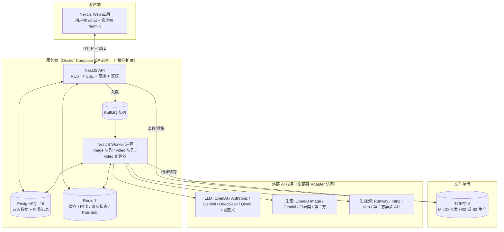
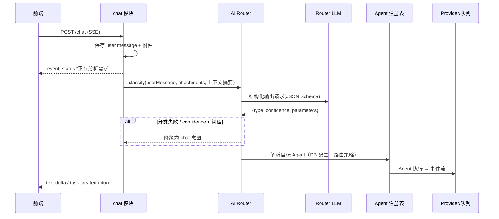
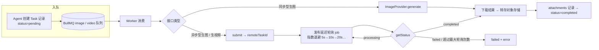
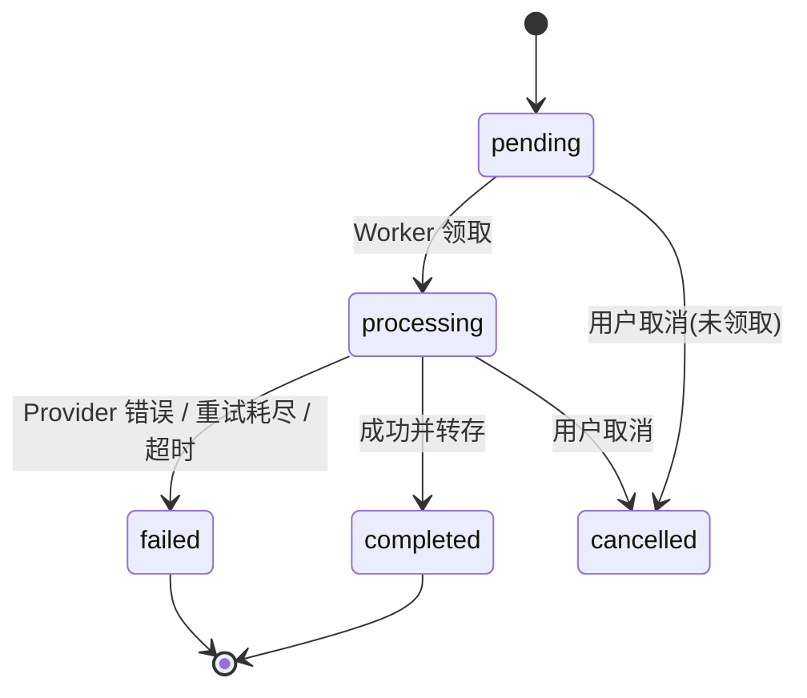
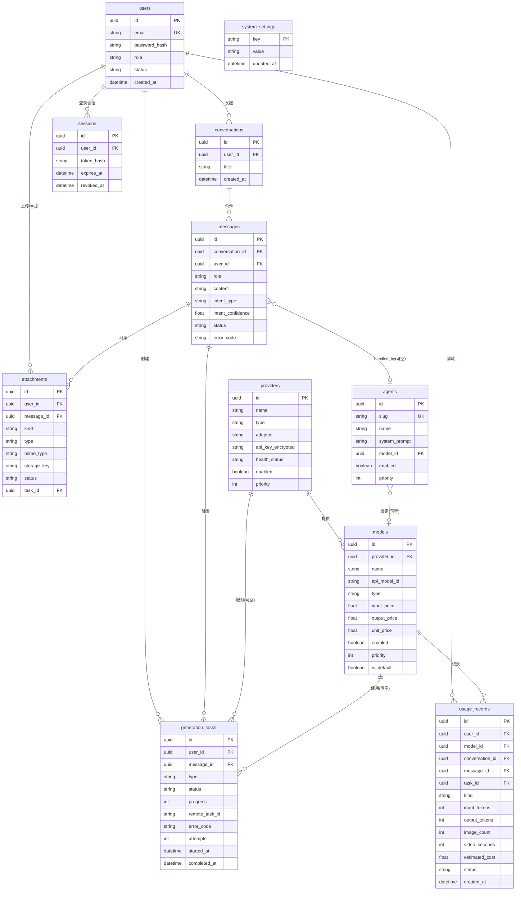
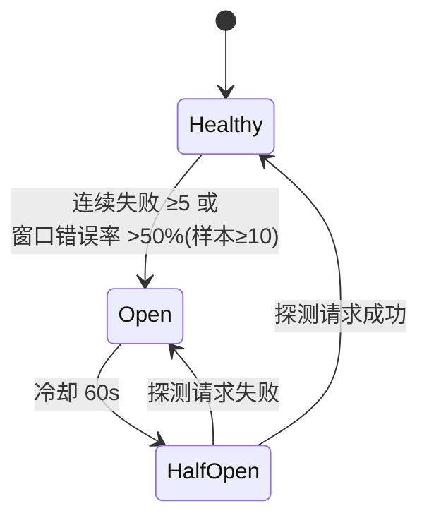

# 《AI Agent 智能创作平台 · 技术架构设计 V1》

| 项 | 内容 |
|---|---|
| 版本 | V1.1（已确认决策，见第 22 节） |
| 日期 | 2026-09-23 |
| 状态 | **已确认**（进入 Phase 2/3：技术选型定稿 + 项目初始化） |
| 范围 | 产品功能架构、系统架构、技术选型、Provider/Agent/Router/Task 四大核心抽象、数据库、API、SSE、存储、安全、错误处理、Fallback、目录结构、MVP 计划 |

---

## 0. 文档导读

- 第 1~3 节：产品与系统全貌、技术选型及理由
- 第 4~9 节：四大核心抽象（Provider / Agent / Router / Task Queue）——本平台的骨架
- 第 10~17 节：数据、API、实时通信、存储、安全、错误与稳定性设计
- 第 18~19 节：目录结构与 MVP 开发计划（对应需求中的 Phase 3~6）
- 第 20~22 节：关键决策对比、风险清单、**待你拍板的决策点**

**作为技术负责人，我先指出两个全局性技术判断：**

1. **本项目不适合"Next.js 全栈单应用"形态。** 原因：平台需要「API 服务 + BullMQ Worker + SSE 流」三类长期运行进程；如果把 Provider 适配层、队列 Worker、后台管理全部塞进 Next.js，会违背你要求的模块化原则。推荐 **pnpm monorepo：`apps/api`（NestJS）+ `apps/web`（Next.js）**，前后端分离但共享一套 TypeScript 类型与校验 Schema。
2. **图片/视频生成的结果必须"下载转存"到自有对象存储。** 第三方 API 返回的图片/视频 URL 通常 1~24 小时过期，直接存 URL 会导致历史对话里的图片全部失效。Worker 拿到结果后下载 → 转存对象存储 → 数据库只存 `storageKey`。

---

## 1. 产品功能架构

```
┌─────────────────────────────────────────────────────────────┐
│                        用户端 (Web)                          │
│  登录注册 │ 对话管理 │ 流式聊天 │ 图片生成 │ 视频生成          │
│  图片理解 │ 文件上传 │ 任务进度 │ 思考状态展示 │ 多轮追问       │
├─────────────────────────────────────────────────────────────┤
│                     管理后台 (Admin)                         │
│  Provider 管理 │ Model 管理 │ Agent 管理 │ Router 配置        │
│  任务管理 │ 用量统计 │ 成本统计 │ Provider 健康状态 │ 用户管理  │
├─────────────────────────────────────────────────────────────┤
│                     平台核心能力层                           │
│  ┌──────────┐ ┌──────────┐ ┌──────────┐ ┌───────────────┐  │
│  │ AI Router│ │Agent 系统│ │Task 系统 │ │ ModelRouter + │  │
│  │ 意图分类 │ │可注册/配置│ │异步任务  │ │ Fallback/熔断 │  │
│  └──────────┘ └──────────┘ └──────────┘ └───────────────┘  │
│  ┌──────────────────────────────────────────────────────┐  │
│  │ Provider 抽象层（LLM / Image / Video / Storage 适配器）│  │
│  └──────────────────────────────────────────────────────┘  │
├─────────────────────────────────────────────────────────────┤
│  基础设施：PostgreSQL │ Redis │ BullMQ │ 对象存储(S3/R2/MinIO)│
└─────────────────────────────────────────────────────────────┘
```

---

## 2. 系统整体架构



**进程拆分（关键设计）：**

| 进程 | 职责 | 说明 |
|---|---|---|
| `apps/web` | Next.js 前端（用户端 + 管理端） | 无任何 Provider 调用逻辑，不接触 API Key |
| `apps/api` (main) | REST + SSE、鉴权、Router、Agent 调度、入队 | 无状态，可多实例水平扩展 |
| `apps/api` (worker) | 消费 image/video 队列、轮询视频任务、下载转存 | 独立入口 `worker.ts`，与 API 同代码库 |

设计要点：
- **API 与 Worker 只通过 Redis（队列 + Pub-Sub）和 PostgreSQL 通信**，天然支持以后拆成独立服务/多实例。
- Worker 发布进度事件到 Redis Pub-Sub → API 订阅后转 SSE（多实例时事件不会丢，为 Phase 5 的任务 SSE 通道预留）。
- 开发环境：`docker compose` 起 PostgreSQL + Redis + MinIO；API/Web 在宿主机跑（Windows 支持良好，Node 全栈）。

---

## 3. 技术选型

### 3.1 总览

| 领域 | 选型 | 关键理由 |
|---|---|---|
| 仓库形态 | **pnpm monorepo + Turborepo** | 前后端共享类型/Schema；任务缓存加速构建；后续加 app 容易 |
| 前端 | **Next.js 15 (App Router) + React 19 + TypeScript** | 你的既定方向；App Router 的 Route Handler 代理与流式渲染成熟 |
| 样式/组件 | **Tailwind CSS v4 + shadcn/ui** | 现代 AI 产品质感（类 ChatGPT/Linear）；shadcn 源码可改，不被组件库锁死；暗色模式内建 |
| 前端状态 | **TanStack Query（服务端状态）+ Zustand（UI 状态）** | 对话列表/任务列表用 Query 自动缓存与失效；聊天流用自定义 `useChatStream` hook |
| Markdown/代码高亮 | react-markdown + remark-gfm + **shiki** | shiki 主题一致性最好（highlight.js 已过时） |
| 后端 | **NestJS 11 + Express 适配器** | 见 3.2 |
| 校验 | **zod（全项目唯一校验源）** | DTO、事件负载、Router JSON 输出，前后端共享 `packages/shared` 中的 schema；不引入 class-validator 双体系 |
| ORM | **Prisma** | 你的既定方向；迁移工具链成熟、类型安全 |
| 数据库 | **PostgreSQL 16** | JSONB 支撑灵活配置（agent tools、模型 capabilities、任务 input/output） |
| 缓存/限流/熔断状态 | **Redis 7** | @nestjs/throttler + Redis 存储；熔断窗口计数 |
| 队列 | **BullMQ** | 你的既定方向；重试/延迟任务/重复任务内建，视频轮询器直接用它 |
| 对象存储 | **Storage Adapter：LocalDisk（dev）/ S3 兼容（MinIO/R2/S3）** | 见第 13 节 |
| 实时通信 | **POST + SSE（fetch stream）**；任务状态 MVP 用轮询 + 预留 SSE 通道 | 见第 12 节 |
| 认证 | JWT（access 15min + refresh 30d，httpOnly Cookie）+ argon2 哈希 | 见第 14 节 |
| 日志 | **pino（nestjs-pino）** 结构化 JSON + requestId 贯穿 | 为成本统计/审计打基础 |
| 测试 | Vitest（单测）+ supertest（e2e，mock Provider） | 快、TS 原生 |
| 部署 | Docker Compose（PG/Redis/MinIO/API/Web/Worker 六个容器） | 单机起步，未来可平移到 k8s |

### 3.2 后端选型说明（NestJS vs Fastify vs Next.js 全栈）

| 方案 | 优点 | 缺点 | 结论 |
|---|---|---|---|
| **NestJS（推荐）** | 模块化目录结构与你要的 `modules/` 一一对应；DI + Guard/Interceptor/Pipe 内建（鉴权、限流、日志切面干净）；@nestjs/bullmq、nestjs-pino 等生态成熟 | 学习曲线略陡；启动稍重 | **选它**：团队化/长期维护最稳，最贴合"平台"定位 |
| Fastify | 性能更高、更轻 | 生态插件质量参差；DI/守卫需自建 | 若未来性能瓶颈，NestJS 可换 Fastify 适配器（成本低），无需现在决定 |
| Next.js 全栈 | 部署最简单 | Worker/SSE/Provider 层与前端耦合；违背模块化原则；多进程形态别扭 | 否决（见第 0 节判断 1） |

### 3.3 对你原选型的调整点（其余均采纳）

1. npm → **pnpm**：monorepo 场景 workspace 管理显著更优。
2. 建议补 Turborepo：任务缓存，前后端并行构建。
3. 校验体系用 **zod 单源**，替代 NestJS 默认的 class-validator（避免前后端两套校验定义）。
4. shadcn/ui + Tailwind v4 作为组件方案（你未指定组件库，此为推荐）。

---

## 4. 前端架构

```
apps/web/
├── app/
│   ├── (auth)/login/page.tsx
│   ├── (chat)/
│   │   ├── page.tsx              # 重定向到 /chat 或最近对话
│   │   └── chat/[id]/page.tsx    # 主聊天界面
│   └── admin/
│       ├── page.tsx              # Dashboard（今日请求量/成本/成功率）
│       ├── providers/            # Provider CRUD + 测试连接 + 健康状态
│       ├── models/               # Model CRUD + 价格配置
│       ├── agents/               # Agent CRUD（prompt/tools/参数）
│       ├── settings/             # Router 配置（默认模型/路由模型/兜底）
│       ├── tasks/                # 任务管理
│       └── users/                # 用户与限额
├── components/
│   ├── chat/  ChatInput / MessageList / MessageBubble / MarkdownRenderer /
│   │          AttachmentPreview / ThinkingStatus / TaskCard / StopButton
│   ├── sidebar/ Sidebar / ConversationList / NewChatButton
│   └── admin/  DataTable / ProviderForm / ModelForm / AgentForm / HealthBadge
├── lib/
│   ├── api.ts                    # fetch 封装（自动带 cookie、错误归一化）
│   ├── sse.ts                    # SSE 解析器（事件→回调）
│   ├── hooks/ useChatStream.ts / useTaskPolling.ts / useUpload.ts
│   └── stores/ conversations.ts / ui.ts   # Zustand
```

**核心交互设计：**

1. **聊天流**：`POST /conversations/:id/chat` → fetch + ReadableStream 逐行解析 SSE。事件驱动渲染：
   - `status` → 顶部 Thinking 状态条（"正在分析需求…" → "正在调用图片生成模型…"）
   - `text.delta` → 流式 Markdown 追加（节流 60ms 批量渲染，避免卡顿）
   - `task.created` → 消息内插入 TaskCard（生成中 0% → …）
   - `done` → 结束
2. **任务状态**：TaskCard 挂载后以 2s 间隔轮询 `GET /tasks/:id`，直到终态（见第 12 节选型理由）。
3. **输入框**：拖拽/粘贴上传 → 附件预览（图片缩略图、文件卡片）→ 发送时携带 `attachmentIds`。
4. **停止生成**：调用 `AbortController` 中断 fetch → 后端收到断开后取消 Provider 流。
5. **重试**：失败消息上的"重试"按钮 → 重建该消息的生成请求（沿用原 attachmentIds）。
6. **移动端**：侧边栏抽屉化；图片/视频全宽展示；输入框工具栏折叠。
7. **主题**：暗色/亮色，默认暗色（AI 产品惯例）；中文优先文案，i18n 结构预留。

---

## 5. 后端架构（NestJS 模块划分）

```
apps/api/src/
├── main.ts            # API 入口（CORS/Helmet/全局管道/限流/SSE 全局头）
├── worker.ts          # Worker 入口（仅挂载 BullMQ 处理器 + 轮询器）
├── modules/
│   ├── auth/          # 注册/登录/刷新/登出 + JWT Guard + 角色 Guard
│   ├── users/         # 用户资料、角色、限额配置
│   ├── conversations/# 对话 CRUD（归属校验）
│   ├── messages/      # 消息读写、上下文组装
│   ├── attachments/   # 上传、校验、存储落盘、预签名
│   ├── chat/          # POST /chat 入口：编排 Router → Agent → SSE 输出
│   ├── agents/        # Agent 注册表 + DB 配置加载
│   ├── providers/     # Provider/Model 注册表 + 适配器实例化（含解密）
│   ├── routing/       # AI Router（意图分类）+ ModelRouter（选模/回退）
│   ├── generations/   # 图片/视频生成编排：入队、状态机
│   ├── tasks/         # 任务查询/取消
│   ├── usage/         # 用量记录、配额检查（限流/限额）
│   └── admin/         # 后台：providers/models/agents/settings/tasks/usage/users/health
├── providers/
│   ├── llm/     llm.types.ts + openai-compatible/ anthropic/ gemini/ + llm.registry.ts
│   ├── image/   image.types.ts + adapters… + image.registry.ts
│   ├── video/   video.types.ts + adapters… + video.registry.ts
│   └── storage/ storage.types.ts + local/ s3/ + storage.registry.ts
├── agents/
│   ├── agent.types.ts + agent.registry.ts
│   ├── chat/ chat.agent.ts
│   ├── image/ image.agent.ts
│   ├── video/ video.agent.ts
│   └── analysis/ image-analysis.agent.ts   # 图片理解（MVP 可选）
├── core/
│   ├── router/        # intent 分类 prompt/schema、置信度策略
│   ├── model-router/  # 候选排序、回退执行、熔断集成
│   ├── circuit-breaker/  # 熔断器 + Redis 健康窗口
│   ├── task/          # 任务状态机、进度发布
│   ├── queue/         # BullMQ 连接、队列定义、处理器注册
│   ├── events/        # Redis Pub-Sub 封装（任务进度事件）
│   ├── crypto/        # AES-256-GCM 加解密
│   ├── storage/       # StorageAdapter 门面
│   └── logger/        # pino 封装、requestId 提取
├── common/            # guards/ interceptors/ filters/ pipes/ decorators/
└── prisma/            # schema.prisma + migrations
```

依赖方向（单向）：`modules → core → providers/agents`；`providers/agents` 之间不互相依赖；一切经 `core` 编排。**新增 Provider = 新增一个 adapter 文件 + 后台登记一条配置，核心业务代码零改动。**

---

## 6. Provider 抽象层

### 6.1 统一接口

```typescript
// —— LLM ——
export interface LLMProvider {
  readonly kind: 'llm';
  chat(params: ChatParams): Promise<ChatResponse>;
  stream(params: ChatParams): AsyncIterable<LLMChunk>;   // {type:'text',text} | {type:'usage',inputTokens,outputTokens}
}
export interface ChatParams {
  model: string;                 // api_model_id（由 DB 配置解析）
  messages: ChatMessage[];       // {role, content(文本或多模态块)}
  temperature?: number; maxTokens?: number;
  responseFormat?: { type: 'json_schema'; schema: unknown };  // Router 结构化输出用
  signal?: AbortSignal;          // 用户停止/超时
}

// —— 生图 ——
// 注意：需求中把生图定义为同步接口，但国内主流生图 API（通义万相等）是异步任务型，
// 因此接口同时支持同步/异步两种形态，异步型与视频共用轮询器（见第 9 节）。
export interface ImageProvider {
  readonly kind: 'image';
  generate(params: ImageGenerationParams): Promise<ImageGenerationResult>;        // 同步型：OpenAI / CogView / 即梦(Ark)
  submit?(params: ImageGenerationParams): Promise<{ remoteTaskId: string }>;      // 异步型：通义万相
  getStatus?(remoteTaskId: string): Promise<ImageRemoteStatus>;                   // 异步型进度查询
}
export interface ImageGenerationParams {
  prompt: string;
  model: string;
  size?: string;                 // '1024x1024' 等，由 adapter 映射
  aspectRatio?: string;          // '1:1' | '16:9' | '9:16' | …
  quality?: 'standard' | 'high';
  referenceImages?: string[];    // 参考图（自有存储 URL，adapter 决定是否支持/降级）
  count?: number;                // 1~4
  signal?: AbortSignal;
}
export interface ImageGenerationResult {
  images: Array<{ url: string; width?: number; height?: number }>;  // 临时 URL，Worker 负责转存
  usage: { imageCount: number; providerModel: string };
}

// —— 生视频（异步）——
export interface VideoProvider {
  readonly kind: 'video';
  submit(params: VideoGenerationParams): Promise<{ remoteTaskId: string }>;
  getStatus(remoteTaskId: string): Promise<VideoRemoteStatus>;   // status/progress/resultUrl
  cancel?(remoteTaskId: string): Promise<void>;
}
export interface VideoGenerationParams {
  prompt: string;
  imageUrl?: string;             // 图生视频
  model: string;
  duration?: number;             // 秒
  aspectRatio?: string;
  resolution?: string;
}
```

### 6.2 Adapter 矩阵（注册即用，不写死）

| Adapter | 覆盖厂商 | 实现方式 |
|---|---|---|
| `openai-compatible` (LLM) | **OpenAI / DeepSeek / Kimi(月之暗面) / 阿里百炼 / 火山方舟 / 智谱** | openai SDK + baseUrl 覆盖 + Bearer key；**六家全部走这一个 adapter**，差异仅在于后台配置的 baseUrl / api_model_id / 能力声明 |
| `anthropic` / `gemini` (LLM) | Claude / Gemini | Phase 5+ 可选接入（不在本次 MVP 名单） |
| 生图 `openai-image` | OpenAI gpt-image-1 / dall-e-3 | openai SDK，同步接口 |
| 生图 `openai-image-compatible` | 智谱 CogView（v4 `/images/generations`，OpenAI 风格参数） | 复用 openai-image 逻辑 + baseUrl 覆盖 |
| 生图 `dashscope-image` | 阿里通义万相 wanx | **异步任务 API**（submit + 轮询，DashScope 原生端点） |
| 生图 `volcano-image` | 火山豆包/即梦生图（Ark `images/generations`） | MVP 可选，视 key 开通情况 |
| 生视频 `dashscope-video` | 通义万相视频 wanx2.x（t2v/i2v） | 异步任务 API（submit/getStatus） |
| 生视频 `volcano-video` | 火山即梦视频（Ark `contents/generations/tasks`） | 异步任务 API |
| 生视频 `zhipu-video` | 智谱 CogVideoX | 异步任务 API，MVP 可选 |
| Storage `local` / `s3-compatible` | LocalDisk / MinIO / R2 / AWS S3 | AWS SDK v3（MinIO/R2 均 S3 兼容） |

**适配说明（V1.1 增补）：**
- Kimi 与 DeepSeek 只有 LLM，无生图/生视频能力；生视频 fallback 链：**万相 → 即梦 → CogVideoX**。
- 全部六家认证均为简单 Bearer API Key → `providers.api_key_encrypted` 一套字段全覆盖。
- 火山引擎部分视觉服务需 AK/SK 签名，MVP 一律走 **Ark 方舟 Bearer 端点**，避免签名复杂度。
- 图片/视频的异步任务型 API（万相生图、全部视频）统一走第 9 节的提交-轮询机制。

### 6.3 注册与配置流

```
DB providers 表（apiKeyEncrypted、baseUrl、adapter 名、enabled、priority）
        │  启动时 + 后台变更后（事件通知）
        ▼
ProviderRegistry（内存 Map<providerId, ProviderInstance>）
        │  只注入 { baseUrl, apiKey(解密), timeoutMs, retry 策略 }
        ▼
Adapter 实例（业务代码只面向接口编程，永远不 import 具体厂商 SDK）
```

- API Key 用 **AES-256-GCM** 加密落库（密钥来自环境变量 `ENCRYPTION_KEY`，见第 14 节），仅在实例化 adapter 的瞬间解密，绝不进入日志、绝不返回前端。
- 所有出站调用统一包裹 `ProviderCallLogger`（记录 latency/tokens/cost/error —— 满足"所有模型调用都有统一日志"）。
- 后台"测试连接"按钮 → 每个 adapter 实现可选 `testConnection()`（发 1 token 的最小请求）。

---

## 7. Agent 架构

### 7.1 统一接口：Agent = 事件流

```typescript
export type AgentEvent =
  | { type: 'status'; stage: string; message: string }       // "正在分析需求…"
  | { type: 'text.delta'; text: string }
  | { type: 'task.created'; taskId: string; kind: 'image' | 'video' }
  | { type: 'artifact'; artifact: ArtifactRef }              // 结果附件引用
  | { type: 'done' }
  | { type: 'error'; error: AgentError };

export interface Agent {
  readonly id: string;
  execute(ctx: AgentContext): AsyncIterable<AgentEvent>;     // 关键：Agent 输出是流
}

export interface AgentContext {
  userId: string; conversationId: string; messageId: string;
  userMessage: string; attachments: AttachmentMeta[];        // 本消息附件
  history: ChatMessage[];                                    // 裁剪后的上下文
  intent: TaskIntent;                                        // Router 判定结果
  mode: 'normal' | 'thinking';                               // 执行策略开关
}
```

**为什么 Agent 输出设计成事件流**：聊天型 Agent 输出文字流，生成型 Agent 输出任务事件——同一接口统一处理，chat 模块把事件逐个序列化为 SSE，无需为每种 Agent 写分支代码。

### 7.2 MVP 内置 Agent（DB 可配，注册表可扩）

| Agent | 触发意图 | 执行逻辑（MVP） |
|---|---|---|
| `chat` 通用聊天 | chat / 兜底 | LLM stream（多模态消息含附件图 → vision 模型） |
| `image` 生图 | image_generation | 组装 prompt（含"换风格"参考图策略，见 8.4）→ 入 image 队列 → 发 `task.created` |
| `video` 生视频 | video_generation | 图/文 → 入 video 队列 → 发 `task.created` |
| `image-analysis` 图片理解 | image_analysis（MVP 可选，成本低） | vision LLM stream 分析上传图片 |

DB 字段：`slug/name/description/systemPrompt/modelId(null=路由默认)/tools(jsonb)/temperature/maxTokens/enabled/priority/builtin`。
> 需求中的 `agent_tools` 表在 MVP 用 `agents.tools` JSONB 替代（YAGNI）：Tool 注册表很小，序列化存即可；当 Tool 数量/权限模型复杂化后（Phase 6）再拆表。

### 7.3 Thinking 模式（Phase 6 实现，架构先行）

不暴露模型内部推理链，只暴露**执行阶段状态**。Agent 之上加执行策略装饰器：

```typescript
// core 层（Phase 6）
NormalStrategy   → 直接调用 Agent
ThinkingStrategy → 分析需求 → 制定计划 → 执行(Agent) → 校验结果 → 组织最终回答
```

- 两种策略下，前端看到的都是 `status` 事件流（"正在分析需求…/正在制定计划…/正在调用图片生成模型…/正在校验结果…"）。
- 若 Provider 层面启用 extended thinking（如 Claude/Gemini 推理模式），推理内容只用于决策，`text.delta` 仍只输出最终回答。

### 7.4 Tool 接口（Phase 6 实现，接口先行）

```typescript
export interface Tool {
  name: string; description: string;
  schema: z.ZodType;                                        // 供 LLM function calling
  execute(input: unknown, ctx: ToolContext): Promise<ToolResult>;
}
// 首批 Tool：generate_image / generate_video / analyze_image / web_search
// 未来 Agent（编程/电商/PPT/文档/数据分析）只需组合 Tool + systemPrompt，不改核心代码
```

---

## 8. AI Router（最核心）

### 8.1 路由流水线



### 8.2 意图 Schema 与分类 Prompt

```typescript
export const TaskIntentSchema = z.object({
  type: z.enum(['chat','image_generation','video_generation',
                'image_analysis','file_analysis','agent_task','workflow']),
  confidence: z.number().min(0).max(1),
  parameters: z.object({
    prompt: z.string(),                    // 生成/分析任务的优化后提示词
    aspectRatio: z.string().optional(),
    duration: z.number().optional(),
    referenceMessageId: z.string().optional(),   // "换一个风格"→引用上一张图
  }),
  agent: z.string().optional(),
});
```

分类 Prompt 输入：用户消息 + 附件摘要（类型/数量）+ 最近 2 轮对话（用户消息 + 上一条 AI 消息的 intent 与产物摘要）。
**这使"换一个风格"可判定**：上文有 image_generation 产物 → 参数携带 `referenceMessageId` → ImageAgent 把上一张图作为参考图传入（支持图生图的 Provider）或把原 prompt 与风格增量合并重写（不支持的 Provider）。

### 8.3 策略要点

| 策略 | 规则 |
|---|---|
| 确定性快路径 | 无文字 + 单图片附件 → 直接 `image_analysis`（省一次 LLM 调用） |
| 置信度阈值 | `< 0.7` → 降级 chat（宁可用聊天兜底，不误触发生成扣费） |
| Router 模型 | 后台可配（`routerModelId`），独立于默认聊天模型；失败走自身 fallback 链 |
| 结构化输出 | 按 models 表 capabilities 声明能力逐级降级：`json_schema`（OpenAI 等）→ `json_object`（DeepSeek 及多数国产模型）→ prompt 约束 + JSON 提取；均 + zod 校验 + 非法重试 1 次 |
| 分类失败 | Router LLM 整体不可用 → 直接 chat 兜底（**Router 永远不能阻塞聊天**） |
| 可观测 | 每条消息落库 `intentType + intentConfidence`，后台可查分类命中率并调 prompt |
| 性能 | 分类增加一次 LLM 往返（约 300~800ms），期间前端已显示"正在分析需求…"状态；Phase 6 可换 embedding 快速分类器 + LLM 复核进一步降延迟 |

### 8.4 多轮追问示例（需求九验收场景）

```
用户: 生成一张科技感插排广告图
  → intent=image_generation → image Agent → task ✓

用户: 换成黑金风格
  → 分类上下文含上一轮产物 → parameters.referenceMessageId=上一条任务
  → ImageAgent: 新 prompt = 原 prompt + "黑金配色，奢华质感"；若 Provider 支持参考图则附带原图
```

---

## 9. Task Queue 架构

### 9.1 队列与状态机





### 9.2 关键设计

| 项 | 设计 |
|---|---|
| 队列 | `image`、`video`（BullMQ）；异步任务（视频 + 异步型生图）轮询共用 BullMQ **delayed job**（指数退避，上限 60s 间隔） |
| 进度 | 第三方无进度 → 前端显示"处理中…"；Worker 可按"已耗时"估算伪进度展示。真实进度写入 DB `task.progress` 字段并发布 Redis Pub-Sub 事件；MVP 前端经轮询读取，Phase 5 起经任务 SSE 通道推送 |
| 超时护栏 | 生图 5min / 生视频 30min 强制标记 failed；重复任务每日清扫孤儿任务 |
| 重试 | BullMQ attempts=3 + 指数退避；**仅重试可重试错误**（见 16.2），不可重试错误直接 failed |
| 取消 | `POST /tasks/:id/cancel`：未领取 → 直接 cancelled；进行中 → 尝试 Provider.cancel()（视频支持则调），否则停止轮询、标记 cancelled（远端任务结果作废） |
| 幂等 | 任务入队带 `taskId` 去重；Worker 完成逻辑按 taskId 幂等写库 |
| 扩展性 | Worker 与 API 独立进程/容器，`worker.ts` 单独启动；多 Worker 实例天然安全（BullMQ 分发） |

**generation_tasks 表**：`id/userId/conversationId/messageId/type/providers/model/status/progress/statusMessage/input(jsonb)/output(jsonb)/remoteTaskId/errorCode/attempts/startedAt/completedAt/costEstimate`。

---

## 10. 数据库 ER 设计

### 10.1 ER 图



### 10.2 表清单与说明

| 表 | 说明 |
|---|---|
| users | 角色 `user/admin`（枚举预留 vip/enterprise）；status 禁用态 |
| conversations | 软删除（deleted_at），标题由首条消息自动截取 |
| messages | `intent_type/confidence` 支撑路由可观测；`content` 为纯文本（Markdown），图片/视频以 attachments 关联呈现——**统一附件系统**（需求十） |
| attachments | `kind: upload/generated_image/generated_video`——生成的媒体与上传文件同源管理，统一走对象存储 |
| agents / providers / models | 平台可配置核心（后台 CRUD，见第 11 节） |
| generation_tasks | 异步任务全生命周期（需求十四） |
| usage_records | 每次 Provider 调用一条（需求二十二成本核算的原始数据） |
| sessions | refresh token 白名单（支持登出/吊销） |
| system_settings | JSONB：`routingPolicy`（默认 LLM/生图/生视频模型、routerModelId、fallbackModelId、置信度阈值）、`limits`（每日生图数、并发数、token 预算） |
| audit_logs / api_keys | Phase 5 增加（后台操作审计、开放 API Key） |

**多租户预留**：所有业务表带 `userId`。未来 SaaS 化：加 `organizations` 表 + 成员关系表，查询层统一 `scopeByTenant()` 即可，无需重构。MVP 不引入 orgId（YAGNI）。

**索引要点**：`messages(conversation_id, created_at)` 游标分页；`generation_tasks(user_id, created_at)`、`generation_tasks(status)` 扫孤儿；`usage_records(created_at)` 聚合统计。

---

## 11. API 设计

Base URL：`/api/v1`。除 auth 外均需 JWT（httpOnly Cookie 自动携带）。

### 11.1 端点清单（MVP）

| 方法 | 路径 | 说明 |
|---|---|---|
| POST | /auth/login /auth/refresh /auth/logout | 登录/刷新/登出（**无开放注册端点**） |
| PATCH | /auth/password | 修改自己的密码 |
| GET | /auth/me | 当前用户 |
| GET/POST | /conversations | 列表（游标）/ 新建 |
| GET/PATCH/DELETE | /conversations/:id | 详情 / 重命名 / 删除 |
| GET | /conversations/:id/messages?cursor= | 历史消息（含附件） |
| **POST** | **/conversations/:id/chat** | **SSE 主入口**：`{message, attachmentIds[], mode: 'normal'}` |
| POST | /attachments | multipart 上传（图/视频/PDF/Word/Excel/TXT） |
| GET | /attachments/:id | 302 到预签名 URL 或流式返回 |
| GET | /tasks/:id | 任务状态（轮询） |
| POST | /tasks/:id/cancel | 取消任务 |
| GET | /tasks?conversationId= | 对话内任务列表 |
| CRUD | /admin/providers | 含 `POST /admin/providers/:id/test`（测试连接） |
| CRUD | /admin/models | 含价格、能力、优先级配置 |
| CRUD | /admin/agents | prompt/tools/参数 |
| GET/PUT | /admin/settings | Router 策略 + 限额配置 |
| GET | /admin/tasks /admin/usage /admin/health | 任务/用量聚合/Provider 健康 |
| POST/PATCH | /admin/users | 创建用户（邮箱+初始密码+角色+限额）、编辑/禁用 |
| POST | /admin/users/:id/reset-password | 重置用户密码 |

### 11.2 统一约定

```jsonc
// 成功
{ "data": … }
// 错误（HTTP 4xx/5xx + SSE error 事件同构）
{ "error": { "code": "QUOTA_EXCEEDED", "message": "今日生图次数已达上限", "requestId": "req_…" } }
```
- 分页：游标（`cursor`）而非 offset，保证流式新增消息下的稳定性。
- 所有写操作返回后即持久（任务除外——任务返回 202 + taskId）。
- 前端只接触自身数据；admin 路由加角色 Guard。

---

## 12. SSE Streaming 设计

### 12.1 选型：POST + SSE（fetch stream），非 WebSocket

| 对比 | POST+SSE | WebSocket |
|---|---|---|
| 场景匹配 | 单向流（AI 输出） | 双向交互 |
| 带请求体 | ✅（EventSource 的 GET 不支持） | ✅ |
| 代理/网关友好 | ✅ 标准 HTTP | 需升级头、粘性会话 |
| 断线重连 | 语义简单（重发消息） | 需自定义协议 |
| 扩展 | 无状态 API 多实例友好 | 需频道管理 |

**结论**：聊天流用 POST+SSE。**任务状态 MVP 用 2s 轮询**（`GET /tasks/:id`）：实现最简单、天然抗断线；Worker 已把进度写 DB + 发 Redis Pub-Sub，Phase 5 只需在 API 挂一个 `/tasks/stream?ids=`（EventSource）订阅 Pub-Sub 即可无痛升级为推送。

### 12.2 事件协议（`Content-Type: text/event-stream`）

```text
event: status          data: {"stage":"routing","message":"正在分析需求…"}
event: status          data: {"stage":"image_generation","message":"正在调用图片生成模型…"}
event: text.delta      data: {"text":"React 的 useEffect…"}
event: task.created    data: {"taskId":"…","kind":"image"}
event: task.completed  data: {"taskId":"…","artifact":{"type":"image","attachmentId":"…","url":"/attachments/…"}}
event: text.done       data: {}
event: done            data: {"messageId":"…"}
event: error           data: {"code":"PROVIDER_TIMEOUT","message":"模型响应超时，请重试","requestId":"…"}
: ping                                  ← 15s 心跳注释行，防代理断连
```

> 说明：`task.progress` / `task.completed` 事件在聊天流中仅在任务极快完成（Agent 仍在流内）时出现；常规路径（尤其视频）下，MVP 由前端轮询 `GET /tasks/:id` 呈现任务终态。这两个事件是 Phase 5 任务 SSE 通道（`/tasks/stream`）的正式协议。

### 12.3 实现要点

- 服务端：`res.writeHead(200, {'Content-Type':'text/event-stream','X-Accel-Buffering':'no', …})` + `flushHeaders()`；`for await (const ev of agentStream)` 逐条写入。
- **取消传播**：`req.on('close')` → AbortController → 终止 Provider 流（停止生成按钮 = 前端 abort fetch）。
- 前端解析：fetch + ReadableStream + TextDecoder 按 `\n\n` 分帧；JSON 解析失败只丢弃该帧不崩溃；`text.delta` 节流合并渲染。
- 心跳：15s 无数据发 `: ping`；nginx 需配 `proxy_buffering off`（生产部署注意点）。

---

## 13. 文件存储设计

```typescript
export interface StorageAdapter {
  put(key: string, stream: Readable, meta: { contentType: string; sizeBytes: number }): Promise<void>;
  createPresignedUrl(key: string, expiresInSec: number): Promise<string>;
  delete(key: string): Promise<void>;
}
```

| 决策 | 方案 |
|---|---|
| 驱动 | `STORAGE_DRIVER=local`（开发，写 `./data/storage`）或 `s3-compatible`（MinIO/R2/S3，S3 API 一套） |
| Key 规则 | `{userId}/{yyyy}/{mm}/{uuid}.{ext}`——用户隔离、按目录管理、无碰撞 |
| 上传流（MVP） | 前端 multipart → API 校验 → 流式转存 → 写 attachments(status=ready) |
| 下载流 | `GET /attachments/:id`：鉴权 + 归属校验 → 302 预签名 URL（15min）或流式回源；**前端永不直接持有存储凭据** |
| 生成物转存 | Worker 下载 Provider 临时 URL → `put` → attachments(kind=generated_*) |
| 限制 | 图片 20MB / 视频 200MB / 文档 50MB；扩展名 + MIME 双重校验 + magic number 嗅探 |
| 未来（Phase 6） | 大视频预签名直传；OCR/PDF 解析（内容抽取后进 LLM 上下文）；知识库 |

---

## 14. 安全设计

| 层 | 措施 |
|---|---|
| **API Key** | 仅存后端；AES-256-GCM 加密落库（`ENCRYPTION_KEY` 环境变量，git 不入库）；只在调用瞬间解密；日志脱敏（`sk-***abc`）；后台仅显示后 4 位；**任何接口都不返回明文** |
| 认证 | argon2id 密码哈希；JWT access 15min + refresh 30d；refresh token 哈希落 sessions 表（可吊销）；Cookie httpOnly + SameSite=Lax + Secure(生产)；**注册方式：仅管理员创建用户**（无公开注册端点，从源头杜绝机器人注册与成本滥用） |
| 权限 | RBAC Guard：`user / admin`（枚举预留 vip/enterprise）；所有资源按 userId 归属校验（越权访问一律 404） |
| 限流（需求二十） | @nestjs/throttler + Redis：登录 5次/分；聊天 20 req/分/用户；**每日生图数（默认 50）、视频并发 1、每月 token 预算**——由 system_settings 配置、usage 模块硬校验 |
| 输入 | zod 全量校验；上传文件类型/大小/魔数校验；消息长度上限；**Prompt 注入**：system prompt 仅后台可改、用户输入以 `user` 角色隔离、Router 分类结果不进用户上下文 |
| 传输/Web | Helmet 安全头；CORS 白名单；nginx 生产反代；requestId 贯穿日志 |
| 内容安全 | 依赖 Provider 内容过滤 + 错误码归一（`CONTENT_FILTERED` 映射为友好中文提示）；Phase 6 可选审核端点 |
| 审计 | Phase 5 起 audit_logs 记录后台操作；登录 IP/UA 记录 |

---

## 15. 错误处理设计

### 15.1 错误分类体系

```typescript
export type ErrorCode =
  // 业务类（可直接映射 HTTP/提示）
  | 'VALIDATION_ERROR' | 'NOT_FOUND' | 'FORBIDDEN' | 'UNAUTHORIZED'
  | 'QUOTA_EXCEEDED' | 'RATE_LIMITED' | 'TASK_NOT_CANCELLABLE'
  // Provider 类（进入回退/熔断决策）
  | 'PROVIDER_TIMEOUT' | 'PROVIDER_RATE_LIMITED' | 'PROVIDER_AUTH'
  | 'PROVIDER_OVERLOADED' | 'PROVIDER_BAD_REQUEST' | 'PROVIDER_CONTENT_FILTERED' | 'PROVIDER_UNKNOWN'
  // 内部类
  | 'ROUTER_FALLBACK' | 'INTERNAL';

// 统一错误对象（贯穿 HTTP 响应 / SSE event / 任务 error 字段）
interface AppError { code: ErrorCode; message: string; retryable: boolean; cause?: unknown; }
```

### 15.2 分层策略

| 层 | 策略 |
|---|---|
| Adapter | 厂商错误 → 归一为 AppError（含 retryable 标记：超时/限流/过载=可重试；认证/参数/内容过滤=不可重试） |
| 全局 Filter | 未捕获异常 → 统一 500 响应 + pino 日志（含 requestId、堆栈），**不向用户泄漏内部细节** |
| SSE 流中 | 流已开始后出错 → `event: error` + `event: done`，前端显示重试按钮 |
| 任务 | error 字段持久化（errorCode + message），终态 failed，前端 TaskCard 展示原因 + 重试入口 |
| 用户提示 | 中文友好文案映射表（`PROVIDER_RATE_LIMITED` → "当前模型繁忙，请稍后再试"），前端可基于 code 定制交互 |

---

## 16. Fallback / Retry / Circuit Breaker

### 16.1 熔断器（每 Provider 一个实例，状态存 Redis，API 与 Worker 共享）



- 健康窗口：Redis 记录每 provider 最近 60s 的 success/fail 计数、latency 分位、lastError、consecutiveFailures。
- 熔断只针对 **retryable 错误**；不可重试错误不计入熔断。
- 后台 `/admin/health` 展示：状态、成功率、延迟、最后错误、最后错误时间、熔断开启时间；支持手动复位。

### 16.2 ModelRouter（选择与回退）

```typescript
interface ModelRouter {
  // 候选 = 启用 && 未熔断，按 priority → cost → 历史延迟排序
  selectCandidates(taskType: 'llm'|'image'|'video', ctx: RouteContext): Promise<ModelCandidate[]>;
  // 逐个尝试：超时(timeoutMs) → 重试(retry.max) → 下一个候选 → 全部失败抛 AppError
  execute<T>(taskType, ctx, fn: (model) => Promise<T>): Promise<{ result: T; usedModel: ModelCandidate; fallbacks: ModelCandidate[] }>;
}
```

- 每次 fallback 落 usage/日志（`fallbackCount` 可统计"某 Provider 今天被兜底了多少次"）。
- **需求十三的用户级指定模型**：Phase 6 增加 `user_model_overrides` 表（userId × taskType → modelId），Router 查询层已预留 ctx.userId；VIP/成本路由同样只改排序函数。

### 16.3 配置示例（providers 表）

```jsonc
{ "timeoutMs": 60000, "retry": { "maxRetries": 2, "backoffMs": [1000, 5000] },
  "circuitBreaker": { "failureThreshold": 5, "cooldownSec": 60, "errorRateThreshold": 0.5 } }
```

---

## 17. 日志与成本统计

### 17.1 统一调用日志（ProviderCallLogger 包裹所有出站调用）

每次调用记录：`requestId / userId / conversationId / taskId / provider / model / kind / inputTokens / outputTokens / imageCount / videoSeconds / latencyMs / estimatedCost / status / errorCode` → 写入 `usage_records`（异步，不阻塞主流程）。

### 17.2 成本模型（需求二十二）

| 类型 | 计费 | 后台可配字段（models 表） |
|---|---|---|
| LLM | input/output 每 1M tokens | input_price / output_price |
| 生图 | 每张 | unit_price |
| 生视频 | 每秒 | unit_price |

- `estimatedCost = tokens × 单价 或 数量 × 单价`（Provider 返回真实 usage 则优先）。
- 后台 Dashboard：今日请求量 / token 消耗 / 图片·视频生成数 / 成功率 / 失败率 / API 成本 / 用户消耗 Top。
- 未来（Phase 6）：用户售价 vs 供应商成本的毛利核算 = 用户订阅/点数定价体系接入同一 usage 数据。

---

## 18. 目录结构（monorepo 全貌）

```
agent-platform/
├── apps/
│   ├── api/                        # NestJS（见第 5 节详细树）
│   │   ├── src/  (main.ts / worker.ts / modules/ / providers/ / agents/ / core/ / common/)
│   │   └── prisma/  (schema.prisma / migrations/ / seed.ts)
│   └── web/                        # Next.js（见第 4 节详细树）
├── packages/
│   └── shared/                     # zod schemas、TS 类型、错误码、SSE 事件类型
├── docker/
│   ├── compose.yml                 # postgres + redis + minio + api + worker + web
│   └── Dockerfile.api / Dockerfile.web
├── docs/                           # 本架构文档 + 后续设计文档
├── .env.example                    # 全部环境变量模板（见下）
├── turbo.json / pnpm-workspace.yaml / package.json
```

核心环境变量：`DATABASE_URL / REDIS_URL / JWT_SECRET / ENCRYPTION_KEY / STORAGE_DRIVER / STORAGE_* / APP_URL / WEB_URL / API_PORT / WORKER_CONCURRENCY / NEXT_PUBLIC_API_URL`

---

## 19. MVP 开发计划

| 里程碑 | 内容 | 对应需求 Phase | 验收标准 |
|---|---|---|---|
| **M0 基础设施** | monorepo 初始化、docker compose（PG/Redis/MinIO）、Prisma schema + migrate、环境变量、pino 日志、health 端点、vitest 骨架 | Phase 3 | compose up 后 API/Web 可跑通，`/api/v1/health` 200 |
| **M1 认证 + 对话 + LLM 流式** | 管理员创建用户/登录/JWT/改密、conversations/messages、`POST /chat` SSE、ChatAgent、LLM registry + `openai-compatible` adapter（覆盖六大厂商，后台配 baseUrl/key/model）、前端聊天界面（流式 Markdown、代码高亮、停止/重试） | Phase 4（前半） | 登录后多轮流式对话可用；断开/停止不崩 |
| **M2 附件 + 图片生成** | 上传（拖拽）+ storage adapter（local/MinIO）、image 队列 + Worker、ImageAgent、生图 adapter：`openai-image`（同步）+ `dashscope-image`（万相，异步）+ `zhipu-image`（CogView）、TaskCard 轮询进度、"换风格"追问 | Phase 4（中） | 上传图片、文字生图、进度展示、结果持久化入对话 |
| **M3 视频生成** | video 队列 + submit/轮询器、VideoAgent、`dashscope-video`（万相 wanx2.x）+ `volcano-video`（即梦 Ark，可选），fallback 链万相→即梦、取消任务、TaskCard 扩展 | Phase 4（后） | 图/文生视频全流程 + 进度 + 取消可用 |
| **M4 AI Router + Agent 注册中心** | 意图分类（可配 router 模型）、agent 注册表（DB 配置）、Thinking 状态流、**图片理解（已纳入：vision 模型经 openai-compatible 多模态消息，qwen-vl / glm-4v / doubao-vision / gpt-4o 任配）** | Phase 4 收尾 | 同一对话中聊天/生图/生视频/分析自动分流，`intentType` 可观测 |
| **M5 管理后台 + 用量/健康** | Provider/Model/Agent CRUD + 测试连接、Router 配置、任务管理、usage_records + Dashboard、熔断器 + 健康页、任务 SSE 通道（可选，订阅 Redis Pub-Sub） | Phase 5 | 后台增删改禁用 Provider 即时生效；成本/用量可见 |
| **M6+（Phase 6）** | Thinking 执行策略、Tool calling、Multi-Agent workflow、成本路由、用户级模型指定、OCR/知识库、预签名直传 | Phase 6 | 按需排期 |

每个里程碑交付：实现 + 单测/关键路径 e2e（Provider 用 mock，不烧真实 API）+ 文档更新；遵循 TDD（红-绿-重构）。

---

## 20. 关键决策与备选方案

| # | 决策 | 方案 A（推荐） | 方案 B | 方案 C | 推荐理由 |
|---|---|---|---|---|---|
| 1 | 后端形态 | NestJS 独立服务 | Next.js 全栈 | Fastify 轻量 | 模块化/生态/团队维护；与需求中的模块目录一一对应 |
| 2 | 实时通道 | POST+SSE | WebSocket | 轮询 | 单向流+带请求体；无粘性会话；代理友好 |
| 3 | 任务状态更新 | MVP 轮询 2s，Phase 5 加 SSE 通道 | 全 SSE | 仅轮询 | 简单可靠先行，Pub-Sub 事件已就位，升级成本低 |
| 4 | ORM | Prisma | Drizzle | TypeORM | 迁移工具链最成熟；你原定方案 |
| 5 | 校验 | zod 单源 | class-validator | 双体系并存 | 前后端共享 schema，避免重复定义 |
| 6 | 组件库 | shadcn/ui + Tailwind v4 | Ant Design | 自研 | 现代 AI 产品质感；源码可控不被锁死 |
| 7 | 队列 | BullMQ | DB 轮询表 | Temporal（重） | 重试/延迟/重复任务内建；复杂 workflow 留到 Phase 6 再评估 Temporal |
| 8 | 生图/视频结果 | Worker 下载转存对象存储 | 直存第三方 URL | 不持久化 | 第三方 URL 会过期（第 0 节判断 2） |
| 9 | 意图分类 | LLM 结构化输出（可配模型） | 关键词规则 | embedding 分类器 | 符合需求七"不写死关键词"；embedding 分类器作为 Phase 6 降延迟优化 |

---

## 21. 风险清单

| # | 风险 | 影响 | 对策 |
|---|---|---|---|
| 1 | 第三方视频 API 任务时长 1~10 分钟且不稳定 | 用户体验差、轮询成本 | 轮询指数退避 + 30min 护栏 + 取消链路 + fallback 链 |
| 2 | Router 误判（把聊天判成生图触发扣费） | 成本 + 信任 | 置信度阈值 0.7 + chat 兜底 + intent 落库可观测可调 |
| 3 | Router 增加 300~800ms 延迟 | 首字延迟 | 立即发 status 事件；Phase 6 embedding 快分类器 |
| 4 | Provider 限额/限流风暴 | 大面积失败 | 熔断器 + 并发上限（视频并发 1、全局 Provider 并发上限）+ 重试退避 |
| 5 | 成本失控 | 财务风险 | usage_records 全量记录 + 每日生成限额 + token 预算 + Dashboard |
| 6 | SSE 被代理缓冲 | 流式失效 | `X-Accel-Buffering: no` + nginx `proxy_buffering off` + 心跳 |
| 7 | 多轮上下文膨胀 | token 成本、响应变慢 | 上下文裁剪（滑动窗口 MVP / 摘要化 Phase 6）+ conversation token 预算 |
| 8 | Windows 本地开发（Docker Desktop 资源占用） | 开发体验 | 可选原生安装 PG/Redis 指引；compose 只起必要服务 |
| 9 | 视频/生图质量与参数因厂商差异大 | 一致性差 | adapter 参数映射层 + 后台配置能力字段，Router 按能力筛候选 |

---

## 22. 已确认决策记录（V1.1）

> 2026-09-23 用户确认，以下决策锁定为开发基线：

| # | 决策 | 结论 |
|---|---|---|
| 1 | 架构形态 | **pnpm monorepo：NestJS API + Next.js Web 前后端分离** |
| 2 | 注册方式 | **仅管理员创建用户**（无公开注册端点） |
| 3 | 界面语言 | **中文优先**，i18n 结构预留 |
| 4 | MVP 供应商 | **OpenAI / 阿里百炼 / 火山方舟 / 智谱 / Kimi(月之暗面) / DeepSeek**：LLM 六家全部走 `openai-compatible` 一个 adapter；生图 `openai-image`（同步）+ `dashscope-image`（万相，异步）+ `zhipu-image`（CogView）；生视频 `dashscope-video`（万相）+ `volcano-video`（即梦 Ark，可选）；Kimi/DeepSeek 无生图生视频能力 |
| 5 | 部署形态 | **Docker Compose 单机**起步 |
| 6 | 图片理解 | **纳入 MVP**（M4，vision 模型可配置：qwen-vl / glm-4v / doubao-vision / gpt-4o） |
