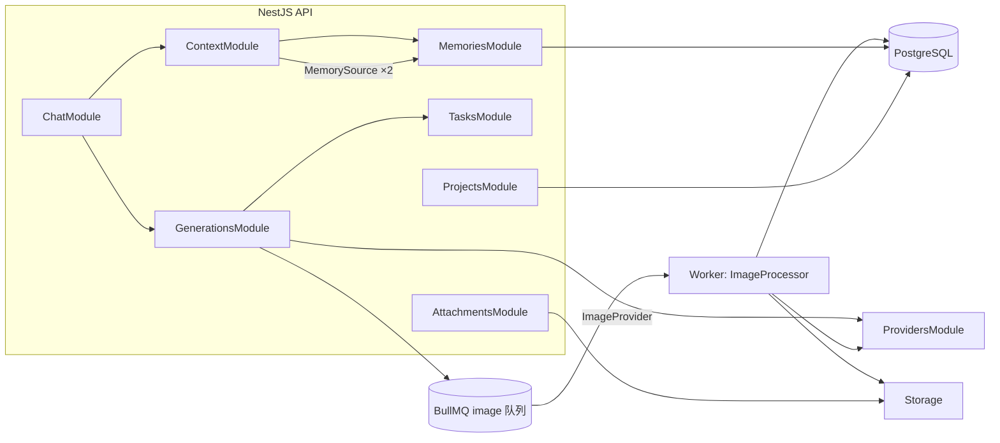
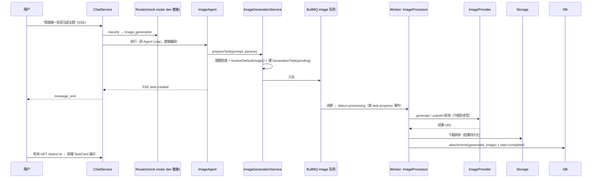

# M2 数据库 + 模块架构方案

| 项 | 内容 |
|---|---|
| 日期 | 2026-09-23 |
| 状态 | **待确认**（确认后进入编码） |
| 范围 | Project 基础 + Memory 基础层 + ContextAssembler 接入 + 记忆候选 + Conversation Summary 结构 + Attachment + Artifact 表 + 图片生成全链路 |

---

## 0. 设计基线核对（已实际读取代码）

| 现状 | 结论 |
|---|---|
| `Conversation`：userId/title/deletedAt，**无 projectId** | 需加 `projectId?` + 索引 |
| `Attachment`：kind(upload/generated_image/generated_video) + type(image/video/file) + storageKey + metadata + status + taskId | **结构已满足六节要求**，仅需：kind 加 `generated_file`、补上传/下载端点、multer 接入 |
| `ContextAssembler`：MemorySource 接口 + register + assemble（order 排序）已就位 | 直接注册两个 M2 source，零修改 |
| `ChatDto`：{conversationId?, message} | 需加 `attachmentIds?` / `projectId?` |
| SSE 事件：task.created/progress/completed schema 已就位（M1 锁定） | 图片生成直接使用，无协议改动 |
| ModelRouter + CircuitBreaker + image/video 队列 + Storage + EventBus | 图片生成全链路复用，**不需要新的 Router 类** |
| `generation_tasks`：input/output Json + remoteTaskId + attempts + progress | 直接承载图片任务（含万相异步任务型） |

---

## 1. 数据模型设计（一次迁移完成全部结构）

### 1.1 Project

```prisma
model Project {
  id          String    @id @default(uuid())
  userId      String
  user        User      @relation(fields: [userId], references: [id], onDelete: Cascade)
  name        String
  description String?   @db.Text
  metadata    Json?
  deletedAt   DateTime?             // 软删除（与 conversations 一致）
  createdAt   DateTime  @default(now())
  updatedAt   DateTime  @updatedAt
  conversations Conversation[]
  memories     Memory[]
  artifacts    Artifact[]
  @@index([userId, updatedAt])
}
```

- **归属**：userId 单所有者（不做多租户/团队/RBAC，按规格）。
- **删除语义**：软删除；项目下 Conversation 保留、仍可访问，只是不再挂在项目下（与"删除对话"的软删除语义一致，零数据丢失）。

### 1.2 Conversation 变更

```prisma
model Conversation {
  ...
  projectId  String?
  project    Project?  @relation(fields: [projectId], references: [id], onDelete: SetNull)
  summaries  ConversationSummary[]
  artifacts  Artifact[]
  @@index([projectId])
}
```

### 1.3 Memory（决策点 1：单表 or 双表）

**方案 A（推荐）：单表 `memories`，`scope` 字段区分 user/project** —— 规格的字段清单完全一致（projectId 可空），一份 CRUD/search/提取逻辑，UserMemorySource 与 ProjectMemorySource 只是两条查询。双表会把 MemoryService 的所有方法复制两份，且未来"用户级记忆推广到项目级"（同一内容两个作用域）在双表下要建同步逻辑。

**方案 B：`user_memories` + `project_memories` 两张同构表** —— 符合规格字面，类型隔离更硬，代价是代码翻倍。

```prisma
enum MemoryScope { user project }
enum MemoryCategory { preference profile instruction project_context workflow other }
enum MemoryStatus { candidate active rejected }

model Memory {
  id              String         @id @default(uuid())
  userId          String
  user            User           @relation(fields: [userId], references: [id], onDelete: Cascade)
  scope           MemoryScope
  projectId       String?        // scope=project 时必填（服务层校验）
  project         Project?       @relation(fields: [projectId], references: [id], onDelete: Cascade)
  content         String         @db.Text
  category        MemoryCategory
  source          String?        // manual | extractor | assistant（来源标记）
  sourceMessageId String?        // 提取自哪条消息
  importance      Int            @default(50)      // 0~100
  confidence      Float?                           // 提取置信度（candidate 阶段）
  status          MemoryStatus   @default(candidate)
  metadata        Json?
  createdAt       DateTime       @default(now())
  updatedAt       DateTime       @updatedAt
  @@index([userId, scope, status])
  @@index([projectId, scope, status])
}
```

- `status: candidate → active/rejected`（四节要求）；M2 **只自动产 candidate，确认由 API 手动完成**（PATCH status）。
- **search**：PG `ILIKE`（Prisma `contains + mode: 'insensitive'`）+ importance 排序——按规格不做 embedding。

### 1.4 ConversationSummary（结构 + 接口，不实现自动摘要）

```prisma
model ConversationSummary {
  id                        String   @id @default(uuid())
  conversationId            String   @unique       // 每个会话一份滚动摘要
  conversation              Conversation @relation(fields: [conversationId], references: [id], onDelete: Cascade)
  summary                   String   @db.Text
  summarizedThroughMessageId String?  // 摘要已覆盖到哪条消息（下次从此继续）
  createdAt                 DateTime @default(now())
  updatedAt                 DateTime @updatedAt
}
```

M2 **无任何写入逻辑**；M6 摘要任务（BullMQ）以 `summarizedThroughMessageId` 为游标滚动生成。

### 1.5 Attachment 变更（仅枚举）

```prisma
enum AttachmentKind {
  upload
  generated_image
  generated_video
  generated_file      // ← 新增（报告/PDF/导出物，M6 用）
}
```

现有字段已覆盖规格（originalName=filename、storageKey、metadata、status）；`url` 不落库——读时经 `GET /attachments/:id` 302 预签名（local:// 流式回源），保证存储凭据不泄露、URL 不过期。

### 1.6 Artifact（表 + 类型，不做 Workflow）

```prisma
enum ArtifactType { creative_brief image video report analysis other }
enum ArtifactStatus { draft ready failed }

model Artifact {
  id             String        @id @default(uuid())
  userId         String
  user           User          @relation(fields: [userId], references: [id], onDelete: Cascade)
  projectId      String?
  project        Project?      @relation(fields: [projectId], references: [id], onDelete: Cascade)
  conversationId String?
  conversation   Conversation? @relation(fields: [conversationId], references: [id], onDelete: SetNull)
  messageId      String?
  taskId         String?
  type           ArtifactType
  title          String
  summary        String?       @db.Text      // 列表卡片摘要
  content        Json?                       // 结构化数据（brief 的 JSON 等）
  storageKey     String?                     // 大体积产物走对象存储
  status         ArtifactStatus @default(ready)
  createdAt      DateTime      @default(now())
  updatedAt      DateTime      @updatedAt
  @@index([userId, createdAt])
  @@index([projectId])
  @@index([conversationId])
}
```

M2：**只有表与 shared 类型，无 API、无写入**。messages.content 不迁移（三层模型锁定）。

---

## 2. 模块依赖关系



- **ChatService 不直接查 memories**：`ChatModule → ContextModule → MemoriesModule`，唯一数据流。
- **ImageProcessor 与 API 解耦**：复用现有 Worker 入口（`worker.ts`），处理器注册进 `WorkerModule`。
- **"ImageRouter"不新建类**：`ModelResolverService.resolveDefaultImage()`（routingPolicy.defaults.image → isDefault → priority）+ 现有 `ModelRouterService.execute`（熔断过滤 + 可重试回退）组合完成。

---

## 3. API 列表（新增/变更）

### 新增

| 方法 | 路径 | 说明 |
|---|---|---|
| GET/POST | /projects | 列表（本人，非删除）/ 创建 {name, description?, metadata?} |
| GET/PATCH/DELETE | /projects/:id | 详情 / 修改 / 软删除（归属校验） |
| GET | /memories?scope=&projectId=&status=&q= | 列表 + ILIKE 搜索（本人/本项目） |
| POST | /memories | 手动创建（默认 candidate） |
| PATCH | /memories/:id | 修改 content/category/importance/**status**（candidate→active/rejected 即"确认/拒绝"） |
| DELETE | /memories/:id | 删除 |
| POST | /attachments | multipart 上传（图/视频/文档，大小+类型校验）→ 存储 → 返回附件 |
| GET | /attachments/:id | 302 预签名 URL（local:// 流式回源） |
| GET | /tasks/:id | 任务状态轮询（含 progress/statusMessage/output 引用） |
| GET | /tasks?conversationId= | 会话内任务列表 |
| POST | /tasks/:id/cancel | 取消（M2 仅 pending 态；进行中取消随 M3） |

### 变更

| 路径 | 变更 |
|---|---|
| POST /conversations | body 增加 `projectId?` |
| PATCH /conversations/:id | 支持 `title?` / `projectId?`（移动对话到项目） |
| GET /conversations | query 增加 `projectId?` 过滤 |
| POST /chat | body 增加 `attachmentIds?: string[]`、`projectId?`（自动建会话时挂项目） |
| GET /conversations/:id/messages | 返回带 `attachments[]`（媒体不进 content，随消息返回） |

### 不新增

Artifact、ConversationSummary：**无 API**（纯结构）。

---

## 4. ContextAssembler 接入（M2 最重要部分）

### 4.1 顺序锁定（types.ts 增加常量，未实现的源不产生任何数据）

```typescript
// core/context/types.ts 追加
export const CONTEXT_ORDER = {
  system: 0,          // M6 实现 SystemPromptSource
  project_memory: 10, // M2 实现 ✅
  user_memory: 20,    // M2 实现 ✅
  summary: 30,        // M6 实现 ConversationSummarySource
  knowledge: 40,      // M6+ 实现 KnowledgeSource（RAG）
  recent_messages: 100, // M1 已实现 ✅
} as const;
```

### 4.2 M2 注册两个源（ContextModule 组装）

- `ProjectMemorySource`：`AssembleContext.projectId` 存在时，取该项目 `status=active` 的记忆（importance 降序，上限 10 条）。
- `UserMemorySource`：取 `scope=user && status=active`（importance 降序，上限 10 条）。
- 两者均输出 **role='user'** 的块、content 带前缀标记：
  - `【用户长期记忆】偏好：亚马逊主图 2000×2000`
  - `【项目记忆】品牌：科技感智能插排，黑金配色`
- **role 选 user 的原因（决策点 2）**：memory 块以 system 角色注入会遇到兼容性问题（Anthropic 风格端点不允许多条 system），以 user 角色 + 标记前缀在所有 OpenAI 兼容端点行为一致，且模型普遍遵循"用户自述偏好"的语义。
- **M1 行为零变化**：无 projectId 且无记忆时，两个源返回空数组，组装结果与 M1 逐字一致；Router 的 `slice(-2)` 取尾部 = 最近消息，不受影响。

### 4.3 AssembleContext 变更

```typescript
export interface AssembleContext {
  ...(现有字段不动)
  projectId?: string;   // ← 新增：来自 conversation.projectId
}
```

ChatService.prepareChat 传入 `conversation.projectId`。

---

## 5. 记忆提取（"越用越聪明"第一版）

```
用户消息 + AI 回复 + 项目上下文
        ↓
MemoryExtractor.extractCandidates()   ← LLM 调用（defaults.llm，json_object 输出）
        ↓
[{content, category, importance, confidence}]
        ↓ 只保存 confidence ≥ 0.7 的候选
memories（status=candidate, sourceMessageId, source=extractor）
        ↓ 人工确认（PATCH status → active/rejected）
ContextAssembler（仅 active 参与组装）
```

- **触发**：ChatService.finalize 之后 fire-and-forget（不阻塞 SSE 收尾，失败仅记日志）。
- **不自动无限保存**：只存 candidate、置信度阈值 0.7、且每人每日提取上限（system_settings.limits 扩展 `dailyMemoryCandidates: 20`，防成本失控）。
- 提取 prompt 要求：只提取用户明确表达的偏好/指令/事实（如"以后都按 2000×2000 做"），不提取一般问答内容。
- 接口先行为后：`MemoryExtractor` 接口 + `LLMMemoryExtractor` 实现（fake LLM 单测覆盖）。
- 开发环境：默认 LLM 是 mock（返回 echo）→ 提取必然产出 0 候选，安全降级；真实 key 配置后自动生效。

---

## 6. 图片生成链路（复用既有抽象，不写死）



**ImageProvider 实现（M2 三个 + 一个 mock）：**

| adapter | 形态 | 说明 |
|---|---|---|
| `openai-image` | 同步 | gpt-image-1/dall-e-3 |
| `zhipu-image` | 同步（OpenAI 风格 images API） | CogView |
| `dashscope-image` | **异步任务型**（submit + getStatus） | 通义万相；轮询复用 M3 视频轮询器同款 delayed-job 模式，M2 内先做图片版最小实现 |
| `mock-image` | 同步 | **dev/e2e 替身**：返回硬编码 1×1 PNG（无 Key 全链路可跑，与 mock LLM 同哲学） |

- `ImageGenerationService`（modules/generations）：限额（limits.dailyImage，按 usage_records kind=image 当日计数）、参数校验（size/aspectRatio/quality）、建任务、入队、状态机（pending/processing/completed/failed）、结果转存 → attachments(kind=generated_image, taskId)。
- Worker 侧 `ImageProcessor` 注册进 WorkerModule；进度经现有 EventBus 发布（M5 起接 SSE 通道，M2 前端轮询）。
- Chat 侧：新 `ImageAgent`（agents/image/）——emit status → 调 ImageGenerationService → emit task.created → done。**不是 Agent Loop**（无 LLM tool-calling），M6 再升级。

### 6.1 开发环境意图路由（决策点 3：mock-router）

M1 的 routerModelId=null → 一切走 chat 兜底。M2 要在 dev 无真实 Key 下触发 image_generation，**新增 `mock-router` 适配器**（仅 dev/e2e 用）：

- 独立 adapter（不动 MockLLMAdapter 的 echo 行为），实现与 openai-compatible 同接口；
- 逻辑：简单启发式（含"图/图片/海报/主图"且非纯问答 → image_generation；含"视频" → video_generation 预留；否则 chat），输出合法 TaskIntent JSON；
- seed 更新：新增 `本地路由替身` provider + 模型，`routingPolicy.routerModelId` 指向它；
- 生产语义不变：routerModelId 配真实模型后 LLM 分类自动接管，代码零改动；
- **明确边界**：启发式只存在于 dev 替身 adapter 内，核心 Router 仍是 LLM 分类 + 阈值 + 兜底。

---

## 7. 前端改动（M2 第 14 步）

- **ChatInput**：拖拽/粘贴上传 → `POST /attachments` → 附件预览 chip（可移除）→ 发送携带 attachmentIds。
- **消息渲染**：assistant 消息随 messages 返回 attachments（图片网格预览 + 点击放大）。
- **TaskCard**：泛化任务卡片（kind 字段预留）——task.created 时插入，2s 轮询 `GET /tasks/:id`，展示 statusMessage/进度/结果图，失败重试入口（M3 补取消）。
- **Sidebar**：顶部 Project 选择器（全部/各项目）+ 新建项目弹窗；会话列表按所选项目过滤；新建对话归属当前项目。
- **记忆**：不建独立 UI；候选记忆在 M5 后台可见（M2 仅 API）。

---

## 8. 测试与冒烟计划

| 层 | 内容 |
|---|---|
| 单测 | MemoryService CRUD/search/作用域校验；MemoryExtractor（fake LLM：合法 JSON→候选、低置信度丢弃、非法 JSON→0 候选）；两个 MemorySource（fake MemoryService：active 过滤、importance 排序、上限 10、前缀格式）；ImageGenerationService（限额/状态机/入队，fake queue）；ImageProcessor（fake provider + fake storage：转存与 attachments 落库）；mock-router 分类（各启发式分支）；mock-image 输出合法 PNG 字节 |
| e2e | projects 全 CRUD + 越权 404；memories CRUD/search + candidate→active 确认流；附件上传（multipart 超限 413/类型拒绝）+ 下载；**图片生成全链路**（mock-image + mock-router：POST /chat "帮我做一张图" → SSE task.created → 轮询任务 completed → messages 带 generated_image 附件）；ChatDto attachmentIds 校验 |
| 冒烟 | 浏览器：登录 → 建项目 → 项目内对话 → 上传图片 → 对话生图 → TaskCard 进度 → 图片入消息 |

---

## 9. M2 实现 vs 仅预留清单

**实现（有行为）：** Project CRUD、conversation↔project 归属、memories 全 CRUD+search、MemorySource×2 + ContextAssembler 接入、MemoryExtractor（candidate 流）、Attachment 上传/下载、ImageProvider×4（含 mock-image）、ImageGenerationService + ImageProcessor、tasks 查询/cancel(pending)、SSE task.* 事件接线、ChatDto 扩展、mock-router dev 替身、前端（上传/TaskCard/Project 侧栏）、限额检查（dailyImage、dailyMemoryCandidates）。

**仅结构/接口（无行为）：** conversation_summaries 表、artifacts 表、SystemPromptSource/ConversationSummarySource/KnowledgeSource（CONTEXT_ORDER 常量 + 注释）、MemoryStatus 自动确认策略、AttachmentKind.generated_file 的写入方、cancel 进行中任务（M3）。

---

## 10. 迁移清单（单次 migration：`m2_project_memory_artifact`）

1. 新表：Project、Memory、ConversationSummary、Artifact
2. 新枚举：MemoryScope、MemoryCategory、MemoryStatus、ArtifactType、ArtifactStatus；AttachmentKind + generated_file
3. Conversation + projectId + 索引
4. seed 更新：mock-router provider/model + routingPolicy.routerModelId 指向它 + limits 加 dailyMemoryCandidates

---

## 11. 待确认决策点

| # | 决策 | 推荐 | 备选 |
|---|---|---|---|
| 1 | memories 单表（scope 字段） | ✅ 单表 | user_memories + project_memories 双表 |
| 2 | 记忆注入 role + 前缀标记 | ✅ role=user + 【用户长期记忆】/【项目记忆】前缀 | system 角色多块（部分端点兼容性风险） |
| 3 | dev 意图路由 | ✅ mock-router 独立替身 adapter | 仅 e2e 注入 fake / 必须配真实 key |
| 4 | Project 删除语义 | ✅ 软删除（对话保留） | 硬删除 + 对话 SetNull |
| 5 | 图片生成 e2e | ✅ mock-image（1×1 PNG） | 仅单测，不跑全链路 e2e |
| 6 | MemoryExtractor 触发 | ✅ finalize 后 fire-and-forget + 每日上限 | 同步阻塞（延迟响应） |

确认后我按「十」的开发顺序实施：每完成一个子阶段运行全仓测试 + 提交，最后整体冒烟。
