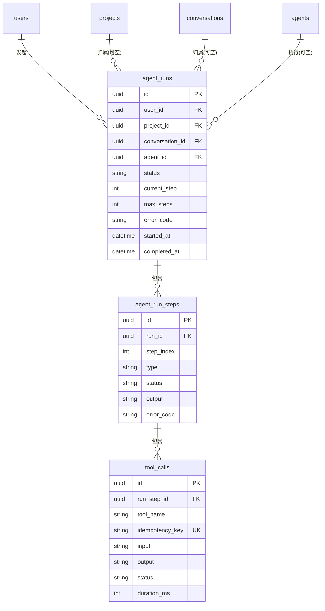

# M4 Agent + Tool + Agent Loop 架构方案

| 项 | 内容 |
|---|---|
| 日期 | 2026-09-23 |
| 基线 | M0~M3 实际代码（184 测试全绿），本文档所有"现状"均经代码核验，非假设 |
| 状态 | **待确认**（不写代码、不改 schema、不提交；确认后进入 M4 实施） |

---

## 1. 当前架构分析（代码核验结论）

| 组件 | 现状（核验） | 对 M4 的意义 |
|---|---|---|
| Agent 接口 | `Agent = { id; execute(ctx) → AsyncIterable<AgentEvent> }`（agents/agent.types.ts） | ✅ 事件流模型正确，M4 直接复用 |
| AgentRegistry | 存在但**未接 DI**（agent.registry.ts 零引用） | M4 接线：DB 配置驱动 |
| agents 表 | slug/name/systemPrompt/modelId/tools(Json)/temperature/maxTokens/enabled/priority/builtin/config；**无 kind/version**；从未被读取 | 加 kind/version 后即 Agent Definition 载体 |
| ChatService Agent 选择 | **三路硬编码 switch**（chat.service.ts:106-108，工厂注入） | M4 用注册表替换——正是要消除的写死点 |
| ChatAgent | options.resolveLLM + systemPrompt，无工具能力 | M4 升级为 Agent Loop 驱动 |
| ImageAgent/VideoAgent | 直接编排 MediaGenerationService（无 LLM） | ✅ 保持（单一目的分发 Agent ≠ 生成服务），M4 作为独立 Agent 留在注册表 |
| ContextAssembler | MemorySource 注册制 + CONTEXT_ORDER，零 chat 依赖 | ✅ 所有 Agent 统一复用，无需改动 |
| MediaGenerationService | 统一任务生命周期 + executor 策略 + 幂等/超时/清扫 | ✅ 就是 Tool 的底层执行能力 |
| Tool | **无接口无实现**（仅架构文档契约） | M4 建立 core/tools 层 |
| LLM 层 | llm.types **无 tools/tool_call 支持** | M4 扩展（见 §8） |
| SSE | agent.*/tool.*/run.*/artifact.created/approval.requested **仅锁定名字，无 schema** | M4 补 agent.*/tool.* schema；run.*/approval 留 M6 |
| Artifact | 表存在，**无 service、无 API、无写入方** | M4 实现最小 ArtifactService（artifact.create Tool 用） |
| AgentRun/Step/ToolCall | 无表 | M4 新建（§15） |
| Memory | MemoryService + Extractor（candidate 流）完整 | ✅ memory.create_candidate Tool 直接复用 |
| Usage | usage_records 无 runId | M4 加可空 runId（按 Run 聚合成本） |
| 幂等 | GenerationTask 层已闭环（原子 claim/单结果）；**循环层无幂等键** | M4 补 ToolCall idempotencyKey（§18） |

---

## 2. Agent Architecture（总览）

```
User → Chat → Intent(Router) → AgentRegistry(按意图映射) → Agent
                                                              │
                                     ┌────────────────────────┼─────────────────────────┐
                              General Assistant         Image Agent             Video Agent
                              （Agent Loop 决策者）      （直接编排，M2/M3 现状）  （直接编排）
                                     │                        │                        │
                                 Agent Loop                   └──────────┬─────────────┘
                                     │                                   │
                               Tool Registry                    MediaGenerationService
                                     │                                   │
                       ┌─────────────┼──────────────┬──────────┐         │
                 image.generate  video.generate  artifact.create  memory.   │
                       │              │              │       create_    │
                       └──────┬───────┘              │       candidate  │
                              │                      │              │    │
                       ImageGenerationService   ArtifactService  MemoryService
                       VideoGenerationService
                              │
                        Provider Adapter
```

**分层铁律**：`Agent → Tool → Service → Provider`。Agent 永不直接触碰 Provider 或 Service 内部实现；Service 永不把自身暴露为 Tool（Tool 是薄封装：schema 校验 + 权限 + 上下文注入 + 调用 Service）。

---

## 3. Agent Definition

复用现有 `agents` 表 + 两个小字段（M4 迁移）：

```prisma
model Agent {
  // ...现有字段不动
  kind    String  @default("builtin")   // ← 新增：builtin(代码类) | custom(纯 prompt 配置)
  version Int     @default(1)           // ← 新增：prompt 版本号（未来热更/回滚）
}
```

- **注册表**：`AgentRegistry` 接 DI；启动时从 DB 加载 enabled 的 Agent 行，`kind=builtin` 按 `slug` 映射代码类（general-assistant / image / video），`kind=custom` 用通用 Loop Agent + 行内 systemPrompt。
- **意图映射**（替代 chat.service.ts:106 硬编码）：`routingPolicy.agentMapping = { chat: 'general-assistant', image_generation: 'image', video_generation: 'video' }`（system_settings，可后台改）。
- **seed**：General Assistant（tools: [image.generate, video.generate, artifact.create, memory.create_candidate]，systemPrompt 为通用助手）、Image Agent、Video Agent 三行。
- 未来 Agent（Data/Research/Advertising）＝新代码类或纯 prompt 行，注册表零改动。

---

## 4. AgentRun

**概念边界（写死）**：AgentRun = **一次 Agent 执行过程**（M4 内嵌在 chat SSE 流中同步执行）；Workflow = 未来显式多步骤编排（M6）。两者不同表、不同引擎。

```prisma
enum AgentRunStatus {
  queued      // 预留：M6 异步运行入口
  running
  completed
  failed
  cancelled
  timeout
}

model AgentRun {
  id             String         @id @default(uuid())
  userId         String         // REQUIRED——所有查询的权限边界
  user           User           @relation(fields: [userId], references: [id], onDelete: Cascade)
  agentId        String         // REQUIRED
  agent          Agent          @relation(fields: [agentId], references: [id], onDelete: Restrict)
  projectId      String?        // OPTIONAL（Chat/API/后台任务/Workflow 均可发起）
  project        Project?       @relation(fields: [projectId], references: [id], onDelete: SetNull)
  conversationId String?        // OPTIONAL
  conversation   Conversation?  @relation(fields: [conversationId], references: [id], onDelete: SetNull)
  status         AgentRunStatus @default(running)
  currentStep    Int            @default(0)
  maxSteps       Int            @default(8)
  errorCode      String?
  errorMessage   String?
  metadata       Json?
  createdAt      DateTime       @default(now())
  startedAt      DateTime       @default(now())
  completedAt    DateTime?
  steps          AgentRunStep[]
  @@index([userId, createdAt])
  @@index([conversationId])
}
```

- **强制约束（已定稿）**：userId、agentId REQUIRED；projectId、conversationId OPTIONAL（未来 API/后台/Workflow/定时任务发起 run 不受 Chat 束缚）。
- **归属校验（已定稿）**：`conversationId != null` 时必须校验会话属于当前 userId；`projectId != null` 时校验项目属于当前 userId，且若两者同时存在，会话的 projectId 与 run.projectId 必须一致（project scope 校验）。
- **权限隔离**：所有 AgentRun 查询以 userId 为第一条件；Tool 上下文继承（§24）。
- **终态保证**：run 永远到达 completed/failed/cancelled/timeout 之一（§19 状态机）。

**状态机（正式锁定，已定稿）**：

```
queued   → running    ✅
queued   → cancelled  ✅
running  → completed  ✅
running  → failed     ✅
running  → cancelled  ✅
running  → timeout    ✅

completed → running   ❌ 禁止
failed    → running   ❌ 禁止
cancelled → running   ❌ 禁止
timeout   → running   ❌ 禁止
```

- 所有状态迁移用 `updateMany(where: {id, status: 当前态})` 条件更新实现，数据库层面杜绝终态复活。
- **Retry = 新 Run**：终态 run 不可回退；未来如需重试，创建新 AgentRun（必要时加 `retryOfRunId` 字段，M6 再定）——M4 不实现 Retry Run System。

---

## 5. AgentRunStep

```prisma
enum AgentRunStepType {
  reasoning    // 预留：只存公开执行摘要（如"分析需求"），绝不存 LLM 内部 CoT
  tool_call
  tool_result
  final
}
enum AgentRunStepStatus {
  running
  completed
  failed
  cancelled
}

model AgentRunStep {
  id           String            @id @default(uuid())
  runId        String
  run          AgentRun          @relation(fields: [runId], references: [id], onDelete: Cascade)
  stepIndex    Int
  type         AgentRunStepType
  status       AgentRunStepStatus @default(running)
  input        Json?
  output       Json?              // final 步骤的最终回答文本 / tool 步骤的摘要
  errorCode    String?
  errorMessage String?
  startedAt    DateTime          @default(now())
  completedAt  DateTime?
  toolCalls    ToolCall[]
  @@unique([runId, stepIndex])    // 幂等锚点
}
```

**CoT 红线**：`reasoning` 类型仅存公开状态文案（与 SSE status 事件同源）；模型隐藏推理链不进库、不进 SSE。

---

## 6. Tool Definition

```typescript
// core/tools/tool.types.ts
export type ToolPermission = 'read' | 'write' | 'generate' | 'external_action';

export interface ToolContext {
  userId: string;                 // 强制继承，Tool 不得自定
  projectId?: string;
  conversationId?: string;
  runId: string;
  stepId: string;
  idempotencyKey: string;        // 由 Loop 生成，Tool 透传（§18）
  signal: AbortSignal;
}

export interface Tool {
  name: string;                   // 'image.generate' 命名空间点分格式
  description: string;            // LLM function description（选择质量的关键）
  inputSchema: ZodSchema;         // LLM function parameters 的单一事实源
  outputSchema?: ZodSchema;       // 执行结果校验
  permission: ToolPermission;
  requiresApproval?: boolean;     // M6 审批预留（§14）；M4 全部 false
  timeoutMs?: number;             // 默认 30s；generate 类不适用（任务异步）
  retryPolicy?: { maxRetries: number; retryableCodes: string[] };
  execute(input: unknown, ctx: ToolContext): Promise<unknown>;
}
```

**不把 Service 直接暴露给 LLM**：Service 方法签名（Prisma/Queue 依赖）≠ LLM 友好签名。Tool = 薄适配层：zod 校验输入 → 权限声明 → ToolContext 注入 → 调 Service → 输出校验。四层调用入口（Agent/Workflow/API/后台任务）互不耦合。

---

## 7. Tool Registry

```typescript
// core/tools/tool-registry.service.ts
@Injectable()
export class ToolRegistry {
  register(tool: Tool): void;          // 重名注册报错
  get(name: string): Tool | undefined;
  list(): Tool[];
  has(name: string): boolean;
  listForAgent(agentTools: string[]): Tool[];   // 按 agent.tools 配置取子集 → LLM definitions
}
```

- 注册发生在模块装配期（ToolsModule 提供 4 个 M4 Tool 并注册）。
- **未来注册**（M5/M6）：data.query / knowledge.search / web.search / document.create 等，各自模块注册即用。

---

## 8. Agent Loop

```typescript
// core/agent-loop/agent-loop.service.ts
export interface LoopConfig {
  maxSteps: number;              // agent 行 config 或默认 8
  deadlineMs: number;            // 绝对截止（继承 chat 请求生命周期）
  signal: AbortSignal;           // 用户取消
}

export interface LoopRun {
  runId: string;
  execute(ctx: LoopContext): AsyncIterable<AgentEvent>;   // 输出即现有事件流
}
```

**循环协议（每步）：**

```
1. 组装上下文（ContextAssembler，每步前刷新——工具结果可能改变上下文）
2. LLM 调用（携带 tools = listForAgent(agent.tools) 的 function definitions）
3. 响应判定：
   a. tool_calls 非空 → 逐个执行（M4 顺序执行，保证幂等与错误定位）：
      - zod 校验入参（失败 → 把错误作为 tool 结果回喂，让模型修正）
      - 权限检查（§13）
      - 创建 ToolCall 记录（幂等键）→ emit tool.start → execute（超时/中止包裹）→ 结果落库 → emit tool.end
      - tool 结果作为 role=tool 消息回喂 LLM → 回到 2（step+1）
   b. content 非空 → 流式输出 text.delta → final 步骤落库 → emit agent.end → 结束
4. 护栏（任一触发即终态，见 §19）：maxSteps / deadline / signal.aborted / LLM 错误不可重试 / 连续两次相同 tool 调用（防死循环，loop-detection）
```

**LLM 层扩展（M4 必须，否则无工具调用）：**

```typescript
// llm.types.ts 增量
export interface ToolDefinitionWire { type: 'function'; function: { name: string; description: string; parameters: unknown } }
ChatMessage.role += 'tool'；ChatMessage.tool_call_id?: string；ChatMessage.tool_calls?: Array<{ id: string; function: { name: string; arguments: string } }>;
ChatParams.tools?: ToolDefinitionWire[];
```

- openai-compatible adapter 透传映射（六个厂商均 OpenAI 格式）；`models.capabilities.functionCalling` 声明能力——**不支持工具调用的模型自动降级为单次直答**（Loop 检测到 tools 未生效 → 直接输出内容，不假装循环）。
- **dev/e2e 替身**：MockLLMAdapter 增加确定性 function-calling 模式（消息含"图"且有 image.generate 工具 → 发起对应 tool call）——启发式仅存在于 dev 替身，与 mock-router 同哲学。

**统一 LLM Tool Calling 内部协议（已定稿）**——AgentLoop 不感知任何 Provider 格式：

```typescript
// 内部统一回合结果（chat 非流式用）
export type LLMTurn =
  | { type: 'final'; content: string; usage?: ChatUsage }
  | { type: 'tool_calls'; content?: string; toolCalls: ToolCallRequest[]; usage?: ChatUsage };

// 流式分块扩展（stream 用；文本与工具调用可在同一流中先后出现）
export type LLMChunk =
  | { type: 'text'; text: string }
  | { type: 'tool_calls'; toolCalls: ToolCallRequest[] }   // adapter 内部聚合 delta 后一次产出
  | { type: 'usage'; usage: ChatUsage };

export interface ToolCallRequest { id: string; name: string; arguments: string; } // arguments 为 JSON 字符串
```

- **Provider 格式转换全部收敛在 adapter**：OpenAI/Claude/各家 tool calling 的 delta 聚合、字段命名差异在 adapter 内消化，**AgentLoop 中不允许出现 `if provider === 'openai'` 之类的分支**。
- Loop 的流式策略：文本 delta 实时透传（保持 M1 流式体验）；若同一流中随后出现 tool_calls，已输出文本保留（模型先说话再调工具的边缘场景），继续执行工具。

**事件输出**（Loop 产生，ChatService 透明转发）：沿用 `status`（"正在分析需求…/正在调用图片生成…"）+ 新增 `tool.start/tool.end/agent.start/agent.end`（§12）。

---

## 9. ContextAssembler

**零改动。** Agent 一律通过 `contextAssembler.assemble({userId, conversationId, projectId, excludeMessageId})` 取上下文——Loop Agent 在每步前调用（当前仅最近消息+记忆源；M6 挂 Summary/KB 源后所有 Agent 自动受益）。Agent 不直接查询 Memory（维持 M2 审计结论）。

---

## 10. Memory

`memory.create_candidate` Tool → `MemoryService.create({source:'agent', sourceMessageId, status:'candidate'})`。Agent **只产出候选**，active 确认仍走人工/未来策略——不绕过状态机，不直接写库。提取器（自动候选）与 Agent 主动建议并存，互不干扰。

---

## 11. Image / Video

- `image.generate` Tool → `MediaGenerationService.prepareImageTask`（返回 `{taskId, status:'pending'}`）——**输出任务引用而非等待结果**；任务进度由 task.* 事件 + TaskCard 轮询呈现（M3 机制零改动）。
- `video.generate` 同构。
- ImageAgent/VideoAgent（直接编排）保留为注册表内独立 Agent——"Image Agent ≠ Image Service"的层级隔离由此表呈现：General Assistant 经 Tool 走同一 Service。

---

## 12. SSE

**增量 schema（shared/events.ts，ChatStreamEventSchema 追加）：**

```text
event: agent.start   data: {"type":"agent.start","agentId":"general-assistant","runId":"…"}
event: tool.start    data: {"type":"tool.start","toolName":"image.generate","runId":"…"}
event: tool.end      data: {"type":"tool.end","toolName":"image.generate","runId":"…","status":"completed|failed","outputSummary":"已创建生图任务"}
event: agent.end     data: {"type":"agent.end","agentId":"…","runId":"…","status":"completed|failed"}
```

**严格区分三类事件**（不混为 task）：Agent 事件（agent.*）、Tool 事件（tool.*）、生成任务事件（task.*，M3 已定稿）。
`run.created/run.progress/run.completed`、`approval.requested`、`artifact.created` **保持仅命名锁定**（M1 已锁），M6 起按需补 schema。M4 的 run 内嵌于 chat SSE（同步执行），run.* 推送通道留 M6。

---

## 13. Permission

`Tool.permission`：`read / write / generate / external_action`。
- M4 全部 Tool 落在 read/write/generate，**无 external_action**（广告类操作 M6）。
- Loop 执行前读 permission + requiresApproval：M4 行为 = requiresApproval=true 的 Tool 一律拒绝执行并回喂错误（安全默认）；M6 改为进入审批状态机（§14）。
- permission 只做声明与审计（ToolCall 记录 toolName，可统计权限面），M4 不做复杂 RBAC。

**权限必须服务端控制（已定稿）**：

```
Agent 行（DB）
  ↓ 允许的工具清单 = agent.tools（后台配置，普通用户不可改）
AgentLoop 启动时求交集：listForAgent(agent.tools) ∩ ToolRegistry
  ↓ LLM 只能看到并调用该交集内的 Tool
Tool 执行前再次校验：name ∈ allowed && permission 满足 && requiresApproval 检查
  ↓
ToolRegistry.execute
```

- **LLM 输出不能扩大权限**：模型请求的 tool name 不在允许清单 → 拒绝并回喂"无权限"错误（而不是执行）。
- **用户输入不能扩大权限**：Tool 输入 schema 禁止身份字段；allowed 清单只来自服务端 Agent 行配置。
- 高权限 Tool（external_action）未来必须额外过审批（§14），服务端双重校验位置已留。

---

## 14. Approval 预留（不实现）

状态机（文档锁定，M6 实现）：

```
Tool 执行前 → permission check → requiresApproval?
  ├─ false → execute
  └─ true  → ToolCall.status = waiting_approval
             → emit approval.requested（事件名已锁）
             → 前端审批卡片 → 批准/拒绝
             → 批准 → execute（带 approvalId）；拒绝 → 回喂"用户已拒绝"
```

M4 只落：`requiresApproval` 字段 + Loop 内单点检查位 + 拒绝默认行为。不建 pending_approvals 表。

---

## 15. Database ER



**索引**：agent_runs[userId, createdAt]、[conversationId]；agent_run_steps **UNIQUE(runId, stepIndex)**；tool_calls[runStepId]、[toolName, startedAt]（使用统计）、**UNIQUE(idempotencyKey)**。
**删除语义**：user Cascade（用户删→run 删）；project/conversation/agent SetNull（运行历史保留）。
**变更清单（全部增量，不触碰现有表结构）**：
1. 新表 agent_runs / agent_run_steps / tool_calls + 4 枚举
2. `agents` + kind/version
3. `usage_records` + `runId String?` + 索引（按 Run 聚合成本：LLM+Tool+Image+Video 全链路）
4. `generation_tasks` + `idempotencyKey String? @unique`（§18）

---

## 16. API

| 方法 | 路径 | M4 | 说明 |
|---|---|---|---|
| GET | /agent-runs/:id | ✅ 实现 | 自己的 run + steps + toolCalls（归属校验） |
| GET | /agent-runs?conversationId= | ✅ 实现 | 会话内 run 列表（前端 Run 摘要/调试） |
| POST | /agent-runs | 🔵 预留 | M6 异步启动（长任务脱离 chat SSE） |
| POST | /agent-runs/:id/cancel | 🔵 预留 | M6 长任务取消 |
| GET | /agent-runs/:id/steps | 🔵 预留 | steps 已在 :id 详情内联，独立端点 M6 |
| — | Tool 独立 API | 🔵 不提供 | Tool 只经 Loop 调用；未来 Workflow/后台任务用 Service 层而非 Tool API |

**M4 无 Tool/Agent 管理 API**（M5 后台提供 Agent CRUD）。

---

## 17. Security

- AgentRun/Step/ToolCall：查询一律 `userId` 首条件（与 Task/Attachment/Memory 同模式）。
- **Tool 身份继承**：ToolContext 由 Loop 从 run 注入，Tool 输入 schema **禁止** userId/projectId 字段（zod 层面排除）——Tool 无法冒充他人执行。
- Artifact 经 Tool 创建：userId/projectId/conversationId 全从 ToolContext 继承。
- Run 详情 API 越权 → 404（防枚举，沿用现有约定）。
- Loop 的 LLM 调用沿用 ModelRouter 候选回退（现有机制）。
- Agent 行 systemPrompt 仅后台可改（M5），用户输入仍以 user 角色隔离（M1 约定不变）。

---

## 18. Idempotency

**幂等键作用域（已定稿）：**
- `ToolCall`：**UNIQUE(runId, idempotencyKey)**——同一 run 内不可重复；不同 run 之间同参数调用互不干扰（跨 run 复用输出属于未来优化，不做）。
- `GenerationTask`：**UNIQUE(idempotencyKey)**——全局唯一（任务域天然跨 run）。

**链路（已定稿）：**

```
AgentLoop
  ↓ 生成 ToolCall.idempotencyKey = sha256(runId + stepIndex + toolIndex + toolName + canonical(input))
ToolCall 记录（UNIQUE(runId, idempotencyKey)，执行前查重 → 命中已完成直接复用 output）
  ↓ execute 时把 idempotencyKey 透传给 Service
MediaGenerationService.prepareMediaTask（把 idempotencyKey 写入 GenerationTask.idempotencyKey，UNIQUE）
  ↓
GenerationTask（UNIQUE 约束兜底：同一 ToolCall 重试绝不创建第二个任务）
```

**验收口径**：同一个 ToolCall 重试 = 1 ToolCall + 1 GenerationTask（绝不 1 ToolCall + 2 Tasks）。

三层幂等（自上而下）：

| 层 | 机制 | 解决的问题 |
|---|---|---|
| **Loop 层** | ToolCall UNIQUE(runId, idempotencyKey) + 执行前查重复用 output | Agent 步骤重放/重试不重复执行 Tool |
| **任务层** | GenerationTask.idempotencyKey UNIQUE（Tool 透传） | 同一个 Tool 调用绝不产生两组图片/视频 |
| **执行层** | MediaGenerationService 原子 claim + 条件终态（M3 已闭环） | 队列重复消费/清扫竞态 |

同一 AgentRun 单结果保证：loop 顺序执行 + stepIndex 唯一 + 三层幂等。用户"重新生成"= 新 run（chat 新消息），天然新幂等键。

---

## 19. Failure Recovery（终态保证矩阵）

| 失败 | 检测 | run 终态 | 步骤 | 用户可见 |
|---|---|---|---|---|
| LLM 超时 | Provider timeout（现有归一化） | failed | 当前 step failed | SSE error + 消息 failed（M1 语义） |
| LLM 不可重试错误（401 等） | AppError.retryable=false | failed | 同上 | 同上 |
| Tool 入参非法 | zod 校验 | **不终态**：错误回喂模型修正一次 | tool_call failed → 模型修正 | tool.end(failed) + status 提示 |
| Tool 执行失败（可重试） | retryPolicy | **不终态**：重试后仍失败 → 回喂模型 | 同上 | 同上 |
| Tool 执行失败（不可重试/超时） | timeoutMs/错误码 | 回喂模型一次；再失败 → failed | 同上 | 同上 |
| 模型连续两次调用同一 Tool 同参数 | loop-detection | failed（errorCode=AGENT_LOOP_DETECTED，新错误码） | — | 明确文案"检测到重复操作，已停止" |
| 超过 maxSteps | step 计数 | timeout（errorCode=AGENT_MAX_STEPS，新错误码） | — | "任务过于复杂，已停止" |
| 超过 run deadline | deadline 检查（每步前） | timeout（errorCode=AGENT_RUN_TIMEOUT） | — | "执行超时" |
| 用户取消 | AbortSignal（M1 链路已通） | cancelled | 当前 step cancelled | "已停止"（M1 语义） |
| GenerationTask 失败 | 任务域（M3） | **run 不受影响**：tool.end(status=failed) 回喂"任务失败原因" | — | TaskCard 失败态 |

**新错误码（shared）**：`AGENT_MAX_STEPS` / `AGENT_RUN_TIMEOUT` / `AGENT_LOOP_DETECTED`（均不可重试）。run 永不无限 running：Loop 内每步检查 + chat 连接断开触发 abort + 未来清扫 job 可复用 MediaCleanup 模式兜底（M6 异步 run 时实现）。

---

## 20. Ecommerce Future Compatibility（只检查，不实现）

目标链路映射：

```
Ecommerce Data Agent（M6，kind=custom 或 builtin）
  ↓ data.query Tool（M5/M6 注册）→ DataSourceAdapter → Amazon/Shopify/Meta…
  ↓ Analysis Artifact（artifact.create Tool，M4 已就位）
  ↓ Creative Brief Artifact（同 Tool，type=creative_brief）
  ↓ image.generate / video.generate Tool（M4 已就位）→ MediaGenerationService
  ↓ memory.create_candidate（品牌/受众洞察沉淀）
```

**M4 架构不构成任何阻碍**：新 Agent = 注册表一行/一代码类；新 Tool = 注册即用；Artifact 三层模型已锁（M2 审计）；DataSource 族独立于 Tool 层（M6）。**不实现**。

---

## 21. Agent vs Workflow（严格区分）

| | Agent（M4） | Workflow（M6+） |
|---|---|---|
| 决策 | AI 自主决定下一步 | 开发者/系统预定义步骤 |
| 数据 | AgentRun/Step/ToolCall（M4 表） | 未来 Workflow 表（独立） |
| 触发 | 同步嵌入 chat SSE | 异步长任务（run.* 事件 + task SSE 通道） |
| 引擎 | AgentLoop | 未来 WorkflowEngine |

M4 只实现 Agent。AgentRun 不承载 Workflow 语义；Workflow 引擎落地时**另建**表/模块，不复用 AgentRun 硬塞。

---

## 22. M4 Scope（确认后实施清单，按序）

1. **迁移**（§15 四组增量）+ 枚举 + 索引
2. **shared**：AGENT_MAX_STEPS/AGENT_RUN_TIMEOUT/AGENT_LOOP_DETECTED 错误码 + agent.*/tool.* SSE schema（增量）
3. **core/tools**：Tool/ToolContext/ToolRegistry + 四个 Tool：`image.generate`、`video.generate`、`artifact.create`（含最小 ArtifactService.create，仅写入无 Workflow）、`memory.create_candidate`
4. **LLM 层**：tools/tool 消息类型 + openai-compatible 映射 + capabilities.functionCalling 降级 + MockLLM function-calling dev 替身
5. **core/agent-loop**：循环引擎（maxSteps/deadline/cancel/loop-detection/错误回喂）+ 单测
6. **Agent 注册表接线**：DB 驱动加载 + intent→agent 映射（system_settings）+ seed 三 Agent + general-assistant（Loop Agent 类）
7. **ChatService**：删除三路工厂 switch，改注册表解析；AgentEvent 流透明转发（含新事件）。**兼容性硬约束**：POST /api/chat、SSE 事件序列（message_start→status→text.delta→message_end）、Markdown、会话/消息持久化、ContextAssembler、停止/取消、重试、普通聊天全部与 M1~M3 行为一致——普通 chat 统一进入 General Assistant（Loop）后，纯文本回答必须仍走流式 text.delta 路径；以 M1/M2/M3 全量回归（e2e）为通过标准，不做"为架构纯粹性牺牲稳定性"的重写
8. **前端**：status 流已可渲染工具阶段文案（M1 基础）——M4 仅加"当前工具"小徽标（tool.start/end 驱动），不做 Run Timeline
9. **测试**：Loop 单测（工具调用序列/终止/回喂/护栏）、四 Tool 单测、ArtifactService 单测、AgentRun 权限 e2e、全链路 e2e（"帮我做一套主图" → 模型调用 image.generate → 任务完成）、M1~M3 全量回归

**M4 不做**：异步 run、审批系统、workflow、data.query/web.search/knowledge.search、Ecommerce、Run Timeline UI、Tool 管理后台（M5）。

---

## 23. M5/M6 Scope（衔接预告）

- **M5**：管理后台（Agent CRUD 接 DB 行、Provider/Model 管理、Usage/Run 统计、Provider 健康页）、任务 SSE 通道（订阅鉴权）、会话游标分页
- **M6**：异步 AgentRun（POST /agent-runs + run.* 事件）、Human Approval（pending_approvals + 审批卡片）、Tool 扩展（data.query/web.search/knowledge.search/document.create）、WorkflowEngine、Ecommerce DataSource 族 + metrics 宽表、Memory 确认策略/去重、pgvector/RAG

---

## 三清单

### Must Fix Before M4

**无。** M3 验收通过，当前代码对 M4 无阻塞项（LLM 无 tools 支持、无 Tool 层、Artifact 无服务均为 M4 自身的实施内容，而非前置修复）。

### Recommended（M4 内一并做）

1. §15 的增量迁移（runs/steps/toolcalls + agents.kind/version + usage.runId + generation_tasks.idempotencyKey）
2. 新错误码三枚 + agent.*/tool.* SSE schema
3. ChatService 注册表化（删除写死 switch）——架构升级的核心动作

### Future（M5/M6+，现在不动）

1. 审批系统与 external_action 权限落地
2. 异步 run / run.* 事件 / 取消
3. data.query 等新 Tool 与 Ecommerce 全链路
4. Workflow 引擎（独立表/模块）
5. Run Timeline UI / Agent IDE
